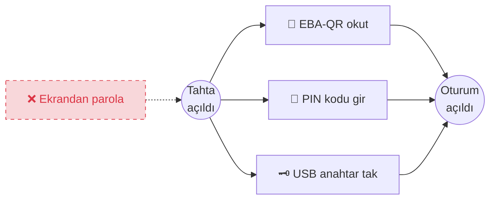

# TiHA — Tahta İmaj Hazırlık Aracı

> Pardus ETAP kurulu sınıf etkileşimli tahtalarını, **imaj yöntemiyle kopyalanıp** yüzlerce tahtaya kolayca dağıtılabilecek biçimde hazırlayan sihirbaz uygulaması.

   

---

## TiHA nedir?

TiHA, öğretmenin tahtaya dokunarak parola girdiği tüm senaryoları ortadan kaldırır. Böylece öğretmen parolasının ifşa olmasına bağlı izin verilmeyen öğrenci kullanımlarının önüne geçilir.

Pardus ETAP 23 kurulu tahtada **tek bir komutla** çalışır — **bilgisayara yüklenmez**, geçici olarak açılıp kapanır. Görsel bir sihirbaz her adımın **ne yaptığını** ve **neden yaptığını** size açıklar, onayınızı alır, sonucu gösterir ve gerektiğinde **geri alır**.

## Hangi sorunu çözer?

Sınıfta öğretmen, tahtada **EBA-QR ile ilk kez oturum açarken** sistem kendisinden bir yerel parola belirlemesini ister. Öğretmen bu parolayı **65 inç dokunmatik ekranda parmağıyla yazmak zorundadır**. Arkadaki sıralarda oturan öğrenciler ekrandaki tuşları rahatlıkla gördüğü için **parolayı ezberler**. Sonraki derslerde öğretmenin hesabıyla tahtayı açıp yetkisiz işlemler yapabilirler.

**TiHA bu sorunu kökten çözer.** İmaj uygulandıktan sonra ekrandan parola yazarak giriş yapmak **artık mümkün değildir**. Öğretmen yalnızca şu üç yoldan biriyle oturum açabilir:

| Yol | Açıklama |
|-----|----------|
| 🔳 **EBA-QR** | Telefondaki EBA uygulamasından ekrandaki kare kodu okutarak |
| 🔢 **PIN kodu** | Google Authenticator gibi bir uygulamadan üretilen, 30 saniyede bir değişen 6 haneli kod |
| 🗝️ **USB anahtar** | Öğretmene özel hazırlanmış kişisel USB bellek |

## Nasıl çalışır?

İmaj uygulandıktan sonra her öğretmen şu üç yoldan biriyle oturum açabilir — **dikkat**, yerel parolayla giriş yoktur:



## TiHA ne değildir?

- ❌ **İmaj alma aracı değildir.** İmajı siz Clonezilla, dd veya benzer bir araçla alırsınız. TiHA yalnızca imaj alınmadan **önceki** hazırlığı yapar.
- ❌ **Pardus ETAP dağıtım medyası değildir.** İşletim sistemini siz temiz kurulum olarak kurarsınız.
- ❌ **Uzaktan yönetim aracı değildir.** Lider-Ahenk bu işe bakar; TiHA Ahenk kurulumuna karışmaz.
- ❌ **PIN doğrulayıcı değildir.** Standart Pardus ETAP PIN/PAM akışı kullanılır; TiHA yalnızca anahtarları toplu üretip yerlerine yazar.
- ❌ **Sisteme kurulmaz.** Çalışır, iş biter, iz bırakmadan silinir.

## Neler yapar?

Sihirbaz bu adımları sırasıyla uygular. Her biri isteğe bağlıdır; ancak ana senaryo için hepsinin uygulanması tavsiye edilir.

| # | Adım | Kısa açıklama |
|---|------|----------------|
| 1  | **Donanım ön kontrol**          | Tahta imajlanmaya uygun mu? SMBIOS, MAC, `machine-id` kontrolü. |
| 2  | **Başlangıç parolaları**         | `root` ve `etapadmin` parolalarını ayarlar; genel hesapları rastgele parolayla kilitler. |
| 3  | **Her açılışta parola temizliği**| Genel öğretmen/öğrenci hesaplarının parolasını her açılışta rastgele değere çeviren sistem servisini kurar. Yönetici `etapadmin` hesabına **dokunulmaz**; teknik erişim korunur. |
| 4  | **Öğretmen PIN anahtarları**     | Öğretmen listenizden 6 haneli PIN kodu üreten güvenlik anahtarlarını imaj öncesinde toplu üretir. Bu adım şart, çünkü Pardus ETAP'ın kendi PIN üretici uygulaması kullanıcının yerel parolasını ister; TiHA bu parolaları sıfırladığı için öğretmen sahada kendi başına PIN kuramaz. |
| 5  | **SSH sunucusu**                 | Tahtayla aynı ağa bağlı bir bilgisayardan uzak terminalle tahtayı yönetmeyi sağlar — teknik bakım için. (Tahtalar ve kablosuz erişim noktaları (AP) genellikle `10.x.x.x` aralığındadır.) |
| 6  | **Samba dosya paylaşımı**        | Tahtanın diskine aynı ağdaki bir bilgisayardan dosya gezgini üzerinden erişmeyi sağlar — güncelleme dosyası bırakmak, günlük çekmek için. (Tahtalar ve AP'ler `10.x.x.x` aralığındadır.) |
| 7  | **Merkezi log iletimi**          | Tahtanın günlüklerini ağdaki merkezi log sunucusuna iletir. |
| 8  | **Zaman senkronizasyonu (NTP)**  | Saat dilimini ve yedek zaman sunucularını yapılandırır. PIN kodları zaman tabanlı olduğu için tahtanın saati doğru olmak zorundadır. |
| 9  | **Benzersiz hostname stratejisi**| Her klonun ilk açılışta kendine özgü bir hostname almasını sağlar. |
| 10 | **Sistem güncellemesi (apt)**    | `apt update` + `full-upgrade` + temizlik. |
| 11 | **İmaj için sanitizasyon**       | Son adım: tekil kimlikleri (SSH anahtarları, `machine-id`, NetworkManager vb.) temizler. |

## Nasıl çalıştırılır?

1. Tahtada **Etap Yönetici** (`etapadmin`) hesabıyla oturum açın.
2. Uygulamalar menüsünden **Terminal**'i açın.
3. Aşağıdaki komutu **kopyalayıp** terminale **yapıştırın** ve **Enter**'a basın:

```bash
curl -fsSL https://raw.githubusercontent.com/enseitankado/tiha/main/bootstrap.sh | bash
```

İlk çalıştırmada tek seferliğine etapadmin parolanızı sorabilir. Sonra sihirbaz penceresi açılır — gerisi tamamen görsel ve adım adımdır.

## Proje yapısı

```
tiha/
├── README.md
├── LICENSE
├── bootstrap.sh                 Tek komutla çalıştıran başlatıcı
├── pyproject.toml
├── data/styles.css
└── tiha/                        Python paketi
    ├── app.py                   Uygulama girişi
    ├── core/                    Altyapı (günce, günlük, yetki, yardımcılar)
    ├── modules/                 11 sihirbaz adımı (m00–m10)
    └── ui/                      GTK3 arayüzü
```

## Dayandığı projeler

TiHA, Modül 4'te (Öğretmen PIN anahtarları) aşağıdaki açık kaynaklı aracı indirip doğrudan kullanır:

- **[enseitankado/eta-otp-cli](https://github.com/enseitankado/etap/tree/main/eta-otp-cli)** — Pardus ETAP'ın `/etc/otp-secrets.json` dosyasıyla bire bir uyumlu, terminal tabanlı TOTP/PIN yönetim aracı. TiHA özellikle `toplu-kullanici-olustur.py` betiğini çağırır; bu betik:
  - Öğretmen listesinden Linux kullanıcılarını doğru gruplarla (cdrom, audio, video, plugdev, bluetooth, scanner, netdev, dip, lpadmin) oluşturur,
  - Her hesap için BASE32 PIN anahtarı üretip `/etc/otp-secrets.json` dosyasına yazar,
  - AccountsService cache'ini günceller — yeni hesaplar LightDM login ekranında görünür olur.

Araç `bootstrap.sh` tarafından otomatik indirilir (`/tmp/tiha.XXXX/eta-otp-cli/`). İndirme başarısız olsa bile TiHA dahili `pyotp` yedek yoluyla (aynı dosya, aynı format) çalışmaya devam eder. Yazara ve projeye teşekkürler — bu iş akışını öğretmen hesaplarının toplu kurulumu açısından oldukça basitleştirdi.

## Katkı ve destek

- 🐛 Hata bildirimi ve öneri: [GitHub Issues](https://github.com/enseitankado/tiha/issues)
- 💬 Soru ve tartışma: [GitHub Discussions](https://github.com/enseitankado/tiha/discussions)
- Pull request'ler hoş karşılanır; ayrıntılar için [`CONTRIBUTING.md`](CONTRIBUTING.md).

## Lisans

GPL-3.0 — ayrıntı için [`LICENSE`](LICENSE) dosyasına bakınız.

Copyright © 2026 Özgür Koca
