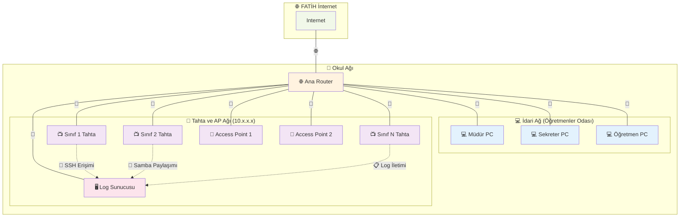

# TiHA — Tahta İmaj Hazırlık Aracı

> Pardus ETAP kurulu sınıf etkileşimli tahtalarını, **imaj yöntemiyle kopyalanıp** yüzlerce tahtaya kolayca dağıtılabilecek biçimde hazırlayan sihirbaz uygulaması.

   

---

## TiHA nedir?

TiHA, Pardus ETAP kurulu bir tahtayı imaj alınmaya hazırlayan; isteyen yöneticiye ek olarak parola sertleştirme ve PIN ile giriş kurulumu sunan bir sihirbaz uygulamasıdır.

Pardus ETAP 23 kurulu tahtada **tek bir komutla** çalışır — **bilgisayara yüklenmez**, geçici olarak açılıp kapanır. Görsel bir sihirbaz her adımın **ne yaptığını** ve **neden yaptığını** size açıklar, onayınızı alır, sonucu gösterir ve gerektiğinde **geri alır**.

## Nasıl çalıştırılır?

1. Tahtada **Etap Yönetici** (`etapadmin`) hesabıyla oturum açın.
2. Uygulamalar menüsünden **Terminal**'i açın.
3. Aşağıdaki komutu **kopyalayıp** terminale **yapıştırın** ve **Enter**'a basın:

```bash
curl -fsSL https://raw.githubusercontent.com/enseitankado/tiha/main/bootstrap.sh | bash
```

İlk çalıştırmada tek seferliğine etapadmin parolanızı sorabilir. Sonra sihirbaz penceresi açılır — gerisi tamamen görsel ve adım adımdır.

## Ne işe yarar?

Tek tahtada hazırlanan bir Pardus ETAP imajını **onlarca tahtaya sorunsuz dağıtmak** için gerekli iki tür hazırlığı tek sihirbazda toplar:

1. **İmaja özel teknik hazırlık** (her senaryoda gereklidir): paket güncellemesi, NTP, benzersiz hostname stratejisi, SSH/Samba ile uzak bakım, merkezi log, güç yönetimi, imaj öncesi tekil kimlik sanitizasyonu ve yer açma.
2. **İsteğe bağlı parola sertleştirmesi**: `root` ve `etapadmin` için bilinçli parola atamak; istenirse açılışta parolaların yeniden rastgeleleştirildiği bir servisle parolalı girişi tamamen kapatmak; öğretmenler için PIN anahtarlarını imaj öncesi toplu üretmek.

> **Tarihçe.** Projeyi başlatan tetikleyici, EBA-QR'ın ilk girişte öğretmenden yerel parola tanımlamasını isteyen ve bu parolanın 65 inç dokunmatik ekrana parmakla yazılması nedeniyle arka sıralardaki öğrenciler tarafından okunabilen davranışıydı. **Bu zorunluluk yeni dağıtımda kaldırıldı.** Yine de ekrana parola yazılması her zaman ifşa riski taşır; o riski tamamen kapatmak isteyenler için TiHA'nın parola sertleştirme adımları olduğu gibi kullanılabilir.

İmaj uygulandıktan sonra öğretmenlerin oturum açabileceği yollar:

| Yol | Açıklama |
|-----|----------|
| 🔳 **EBA-QR** | Telefondaki EBA uygulamasından ekrandaki kare kodu okutarak (Pardus ETAP'ın varsayılan giriş yolu) |
| 🔢 **PIN kodu** | Authenticator uygulamasından üretilen, 30 saniyede bir değişen 6 haneli kod |
| 🗝️ **USB anahtar** | Öğretmene özel hazırlanmış kişisel USB bellek |
| 🔑 **Yerel parola** | Standart yol; TiHA'nın parola sertleştirme adımları uygulandığında kapatılır |

## Neler yapar?

Sihirbaz adımları sırasıyla uygular. Her adım isteğe bağlıdır; sol listeden istediğiniz adıma her zaman geçebilirsiniz. **Parola sertleştirme adımları** (2, 3, 4) bir bütündür; uygulayıp uygulamamak size kalmıştır.

| # | Adım | Kısa açıklama |
|---|------|----------------|
| 1  | **Sistem güncellemesi (apt)** | Tahtadaki paketleri en güncel sürüme çıkarır. Bekleyen güncelleme yoksa adım atlanabilir. |
| 2  | **Yerel hesaplar** | `root`, `etapadmin` (ve isterseniz `ogretmen`) parolalarını siz belirlersiniz. Ortak `ogretmen`/`ogrenci` hesaplarını tamamen silmek için ayrı düğmeler vardır. Geri alma adımı önceki parolalara döndürür. |
| 3  | **Otomatik parola temizliği** | Her açılışta `etapadmin` dışındaki hesapların parolasını rastgele bir değere çevirir; sonradan elle atanan parolalar da bir sonraki açılışta işe yaramaz hâle gelir. *(isteğe bağlı parola sertleştirme)* |
| 4  | **Toplu PIN anahtarı** | Öğretmenler için PIN üreten güvenli anahtarları imaj öncesi merkezî olarak üretip imaja gömer. Öğretmen anahtarını telefondaki Authenticator uygulamasına bir kez ekler; imajdan dağıtılan tüm tahtalarda PIN kodu ile oturum açabilir. Sistemde fazladan hesap varsa toplu silme düğmesi gelir. |
| 5  | **SSH sunucusu** | Tahtayla aynı ağa bağlı bir bilgisayardan uzak terminalle tahtayı yönetmeyi sağlar — teknik bakım için. |
| 6  | **Samba dosya paylaşımı** | Tahtanın diskine aynı ağdaki bir bilgisayardan dosya gezgini üzerinden erişmeyi sağlar — güncelleme dosyası bırakmak, günlük çekmek için. |
| 7  | **Merkezi log sunucusu** | Tahtanın tüm sistem günlüklerini ağdaki merkezi log sunucusuna dayanıklı biçimde iletir; sunucu erişilemez olsa bile loglar yerel diskte birikir, sunucu geri gelince otomatik gönderilir. **Bu adımı uyguluyorsanız 9. adımı (Benzersiz hostname) de mutlaka uygulayın**, yoksa sunucudaki kayıtlar tahtalar arasında birbirinden ayırt edilemez. |
| 8  | **Zaman senkronizasyonu (NTP)** | Saat dilimini ve birincil/yedek zaman sunucularını yapılandırır. PIN kodları zaman tabanlı olduğu için tahtanın saati doğru olmak zorundadır. Girilen sunucuları sınamak için bir test düğmesi vardır. |
| 9  | **Benzersiz hostname** | İmaj alınırken hostname'i şablon (`etap-image` vb.) yapar; her klon ilk açılışta kablolu MAC adresinin son 6 hanesinden türeyen kendine özgü bir ad alır (`etap-ab12cd` gibi). |
| 10 | **Güç yönetimi** | Giriş ekranında tahta belirtilen süre (15–180 dk) boşta kalırsa otomatik kapanır. Aktif SSH bağlantısı, takılı USB veya devam eden işlem varsa kapatmaz; 1 dakika önceden uyarı verir. |
| 11 | **İmaj için sanitize** | Son adım, **geri alınamaz**. Her klonun aynı görünmemesi için tekil kimlikleri (machine-id, SSH host anahtarları, NetworkManager parolaları, DHCP lease vb.) sıfırlar; imajdan önce kapsamlı bir temizlik yaparak yer açar — paket önbellekleri, loglar, kullanılmayan diller, geçici dosyalar, kullanıcı önbellekleri, ayrıca tarayıcı önbellek ve gezinti verileri (Firefox, Chrome, Chromium, Edge, Brave, Vivaldi, Opera, Yandex). Tipik kazanım: 500 MB – 1 GB+. |

## 📡 Ağ Topolojisi ve Erişim Gereksinimleri

Okulların ağ yapısı genellikle şu şekildedir. **5., 6. ve 7. adımların** (SSH, Samba, Merkezi log) sağladığı özellikler **yalnızca tahta ve AP ağından** kullanılabilir.



### ⚠️ Önemli Ağ Kısıtları

- **SSH Erişimi** (5. adım): Tahtaya terminal bağlantısı yapabilmek için **tahta ve AP ağında** (`10.x.x.x`) olmak zorunludur.
- **Samba Dosya Paylaşımı** (6. adım): Tahtanın diskine dosya gezgini ile erişebilmek için **tahta ve AP ağında** olmak zorunludur.
- **Merkezi Log İletimi** (7. adım): Log sunucusu **tahta ve AP ağında** konumlandırılmalıdır.

**İdari ağdaki bilgisayarlardan bu özelliklere erişim yoktur.** Teknik destek için laptop/tablet ile **tahta ağına** bağlanmanız veya log sunucusunu **tahta ağına** yerleştirmeniz gerekir.

## Proje yapısı

```
tiha/
├── README.md
├── LICENSE
├── bootstrap.sh                 Tek komutla çalıştıran başlatıcı
├── pyproject.toml
├── data/styles.css              GTK3 teması
└── tiha/                        Python paketi
    ├── app.py                   Uygulama girişi
    ├── core/                    Altyapı (günce, günlük, yetki, yardımcılar, yollar)
    ├── modules/                 Sihirbaz adımları
    └── ui/                      GTK3 arayüzü
```

## Dayandığı projeler

TiHA, "Toplu PIN anahtarı" adımında aşağıdaki açık kaynaklı aracı doğrudan kullanır:

- **[enseitankado/eta-otp-cli](https://github.com/enseitankado/eta-otp-cli)** — Pardus ETAP'ın `/etc/otp-secrets.json` dosyasıyla bire bir uyumlu, terminal tabanlı TOTP/PIN yönetim aracı. Öğretmen listesinden Linux hesaplarını doğru gruplarla oluşturur, her hesap için PIN anahtarı üretir ve giriş ekranında görünür yapar. Yazara ve projeye teşekkürler — bu iş akışını oldukça basitleştirdi.

## Sanitize adımının esinlendiği projeler

11. adımdaki yer açma katmanı, açık kaynak temizleyicilerin yaklaşımlarını harmanlar:

- [virt-sysprep](https://libguestfs.org/virt-sysprep.1.html) — sanal makine imajlarını "ilk klon" hâline indirir.
- [cloud-init clean](https://cloudinit.readthedocs.io/) — bulut imaj örneklerinde durum sıfırlama.
- [BleachBit](https://www.bleachbit.org/) — kullanıcı önbellek ve gezinti verisi temizliği.
- Debian'ın kendi `apt-get autoremove --purge` + `apt-get clean` + `journalctl --vacuum-*` araç zinciri.

## Katkı ve destek

- 🐛 Hata bildirimi ve öneri: [GitHub Issues](https://github.com/enseitankado/tiha/issues)
- 💬 Soru ve tartışma: [GitHub Discussions](https://github.com/enseitankado/tiha/discussions)
- Pull request'ler hoş karşılanır; ayrıntılar için [`CONTRIBUTING.md`](CONTRIBUTING.md).

## Lisans

GPL-3.0 — ayrıntı için [`LICENSE`](LICENSE) dosyasına bakınız.

Copyright © 2026 Özgür Koca
