# TiHA — Tahta İmaj Hazırlık Aracı

> Pardus ETAP kurulu sınıf etkileşimli tahtalarını, **imaj yöntemiyle kopyalanıp** yüzlerce tahtaya kolayca dağıtılabilecek biçimde hazırlayan sihirbaz uygulaması.

   

---

## TiHA nedir?

TiHA, Pardus ETAP kurulu bir tahtayı imaj alınmaya hazırlayan; isteyen yöneticiye ek olarak parola sertleştirme ve PIN ile giriş kurulumu sunan bir sihirbaz uygulamasıdır.

Pardus ETAP 23 kurulu tahtada **tek bir komutla** çalışır — **bilgisayara yüklenmez**, geçici olarak açılıp kapanır. Görsel bir sihirbaz her adımın **ne yaptığını** ve **neden yaptığını** size açıklar, onayınızı alır, sonucu gösterir ve gerektiğinde **geri alır**.

## Nasıl çalıştırılır?

1. Tahtada **Etap Yönetici** (`etapadmin`) hesabıyla oturum açın.
2. Uygulamalar menüsünden **Terminal**'i açın.
3. Aşağıdaki komutu **kopyalayıp** terminale **yapıştırın** ve **Enter**'a basın:

```bash
curl -fsSL https://raw.githubusercontent.com/enseitankado/tiha/main/bootstrap.sh | bash
```

İlk çalıştırmada tek seferliğine etapadmin parolanızı sorabilir. Sonra sihirbaz penceresi açılır — gerisi tamamen görsel ve adım adımdır.

## Ne işe yarar?

Tek tahtada hazırlanan bir Pardus ETAP imajını **onlarca tahtaya sorunsuz dağıtmak** için gerekli iki tür hazırlığı tek sihirbazda toplar:

1. **İmaja özel teknik hazırlık** (her senaryoda gereklidir): paket güncellemesi, NTP, benzersiz hostname stratejisi, SSH/Samba ile uzak bakım, merkezi log, güç yönetimi, imaj öncesi tekil kimlik sanitizasyonu, yer açma ve Ahenk (LiderAhenk) ajan kimliğinin sıfırlanması.
2. **İsteğe bağlı parola sertleştirmesi**: `root` ve `etapadmin` için bilinçli parola atamak; istenirse açılışta parolaların yeniden rastgeleleştirildiği bir servisle parolalı girişi tamamen kapatmak; öğretmenler için PIN anahtarlarını imaj öncesi toplu üretmek.

> **Tarihçe.** Projeyi başlatan tetikleyici, EBA-QR'ın ilk girişte öğretmenden yerel parola tanımlamasını isteyen ve bu parolanın 65 inç dokunmatik ekrana parmakla yazılması nedeniyle arka sıralardaki öğrenciler tarafından okunabilen davranışıydı. **Bu zorunluluk yeni dağıtımda kaldırıldı.** Yine de ekrana parola yazılması her zaman ifşa riski taşır; o riski tamamen kapatmak isteyenler için TiHA'nın parola sertleştirme adımları olduğu gibi kullanılabilir.

İmaj uygulandıktan sonra öğretmenlerin oturum açabileceği yollar:

| Yol | Açıklama |
|-----|----------|
| 🔳 **EBA-QR** | Telefondaki EBA uygulamasından ekrandaki kare kodu okutarak (Pardus ETAP'ın varsayılan giriş yolu) |
| 🔢 **PIN kodu** | Authenticator uygulamasından üretilen, 30 saniyede bir değişen 6 haneli kod |
| 🗝️ **USB anahtar** | Öğretmene özel hazırlanmış kişisel USB bellek |
| 🔑 **Yerel parola** | Standart yol; TiHA'nın parola sertleştirme adımları uygulandığında kapatılır |

## Neler yapar?

Sihirbaz adımları sırasıyla uygular. Her adım isteğe bağlıdır; sol listeden istediğiniz adıma her zaman geçebilirsiniz. **Parola sertleştirme adımları** (2, 3, 4) bir bütündür; uygulayıp uygulamamak size kalmıştır.

| # | Adım | Kısa açıklama |
|---|------|----------------|
| 1  | **Sistem güncellemesi (apt)** | Önce depo sağlığını kontrol eder (eksik Pardus ETAP depolarını ekler, bozuk `.broken.*` dosyalarını siler), sonra `apt-get update → full-upgrade → autoremove → clean` zincirini çalıştırır. Çıktı canlı akar. Bekleyen güncelleme yoksa adım atlanabilir; "İleri" düğmesi bekleme olmadan etkinleşir. |
| 2  | **Yerel hesaplar** | `root`, `etapadmin` ve isteğe bağlı `ogretmen` parolasını siz belirlersiniz. Parolalar SHA-512 hash olarak **doğrudan `/etc/shadow`'a yazılır** — bu yol PAM politikalarından ve AppArmor kısıtlamalarından etkilenmez, fiziksel/sanal makine farkı yaratmaz. Ayrı bir düğme ile öğrenci hesabını (`ogrenci`) tamamen silebilirsiniz. Geri al adımı `/etc/shadow` yedeğini geri yükler. |
| 3  | **Otomatik parola temizliği** | Her açılışta `etapadmin` dışındaki tüm normal hesapların (UID 1000–59999) parolasını kriptografik olarak güvenli 40 karakterlik rastgele bir değere çeviren bir `systemd` oneshot servisi kurar. Sonradan elle atanan parolalar da bir sonraki açılışta işe yaramaz hâle gelir. *(isteğe bağlı parola sertleştirme — `etapadmin`'in yönetici erişimi her zaman korunur)* Geri alma sırasında varsa standart dışı kullanıcı hesaplarını da silmeyi önerir. |
| 4  | **Toplu PIN anahtarı** | Öğretmenler için PIN üreten güvenli anahtarları (TOTP) imaj öncesi merkezî olarak üretip `/etc/otp-secrets.json` dosyasına kaydeder. Pardus ETAP'ın PAM modülü bu dosyayı doğrudan okur. Üretim için [enseitankado/eta-otp-cli](https://github.com/enseitankado/eta-otp-cli) aracını otomatik olarak GitHub'dan indirir; başarısız olursa pyotp yedek yoluna düşer. Yedek hesap (`ogretmen01`, `ogretmen02`…) sayısı verilebilir. Her hesap için passwd `GECOS` alanına ad-soyad yazılır. Sistemde 50+ kullanıcı varsa LightDM greeter cache betiği otomatik indirilir ve her açılışta çalıştırılır. Ayrı bir düğme ile **varsayılan (etapadmin/ogretmen/ogrenci) dışındaki tüm fazladan hesapları** prosesleri sonlandırıp `deluser --remove-home` ile siler — düğme yalnız fazladan hesap varken görünür. Tüm hatalar mesaj kutusunda inline gösterilir. Üretilen anahtarlar (kullanıcı adı + BASE32 secret + `otpauth://` URL'si) panoya kopyalanabilir veya `.txt` dosyasına kaydedilebilir. |
| 5  | **SSH Sunucusu** | `openssh-server` paketini (yoksa) kurar, `/etc/ssh/sshd_config.d/99-tiha.conf` ile root parolasıyla uzaktan girişe izin verir, `ssh` servisini etkinleştirir. apt çıktısı canlı akar. Geri al: ek yapılandırma dosyası silinir; TiHA paketi yeni kurmuşsa `apt-get purge` ile kaldırılır, daha önce kuruluysa korunur. |
| 6  | **Samba dosya paylaşımı** | `samba` paketini (yoksa) kurar; kök `/` dizinini kullanıcının seçtiği isimle ve istediği Samba parolasıyla paylaşan `[root]` adlı bir paylaşım tanımlar (`/etc/samba/smb.conf.d/tiha-share.conf` + `smb.conf` içine `include`). Windows'tan `\\<tahta-ip>\root`, Linux'tan `smb://<tahta-ip>/root` yolu ile dosya gezgininden erişilir. Geri al: paylaşım tanımı + smbpasswd kaydı kaldırılır; paketi TiHA kurmuşsa purge edilir. |
| 7  | **Merkezi log sunucusu** | Tahtanın tüm sistem günlüklerini ağdaki merkezi `rsyslog` sunucusuna **disk-assisted queue** ile iletir: uzak sunucu erişilemez olduğunda (elektrik kesintisi, ağ bakımı, sunucu arızası) loglar `/var/lib/rsyslog/` altında diskte birikir, sunucu geri gelince otomatik gönderilir. UDP/TCP, varsayılan port 514, 100 MB kuyruk limiti, 30 sn–10 dk arası artan yeniden deneme. Önizleme kuyruğun anlık durumunu (boş / dolu, dosya boyutları) gösterir. **Bu adımı uyguluyorsanız 9. adımı (Dinamik hostname) de mutlaka uygulayın**, yoksa sunucudaki kayıtlar tahtalar arasında ayırt edilemez. |
| 8  | **Zaman senkronizasyonu (NTP)** | `/etc/systemd/timesyncd.conf.d/tiha.conf` üzerinden birincil ve yedek NTP sunucularını + saat dilimini (varsayılan `Europe/Istanbul`) yapılandırır, `systemd-timesyncd`'yi etkinleştirir. PIN kodları zaman tabanlı olduğu için tahtanın saati doğru olmak zorundadır. **"NTP Sunucularını Test Et"** düğmesi girilen sunuculara UDP/123'ten doğrudan paket gönderip yanıt zaman damgasını doğrular (5 sn timeout); sonuç canlı akar. |
| 9  | **Dinamik hostname** | İmaj alınırken hostname'i şablon (`etap-image` vb.) yapar ve `/etc/hosts`'taki `127.0.1.1` satırını da eşitler — aksi hâlde her `sudo` çağrısı ~10 sn DNS timeout'una takılır. Ek olarak her açılışta çalışan bir systemd servisi kurulur; servis kablolu MAC'in son 6 hanesinden `etap-1a2b3c` benzeri benzersiz bir hostname üretir, hem hostname'i hem `/etc/hosts`'u günceller. Hostname zaten doğruysa değişiklik yapmaz; ağ kartı değişirse otomatik yeniden ad atar. |
| 10 | **Otomatik kapanma** | Pardus ETA'nın `eta-shutdown` altyapısının üstüne **zenginleştirilmiş bir çalışma sürümü** kurar (orijinal `service.py` yedeklenip değiştirilir; systemd unit, GUI ve `/etc/pardus/eta-shutdown.conf` korunur). İki mod: belirlenen **sabit saatte** kapatma ve **idle tabanlı** kapatma (1–180 dk). Her iki modda da kapatmadan **2 dakika önce** ekranda GTK geri sayım penceresi açılır; pencereden **"10 dakika ertele"** veya **"Şimdi kapat"** seçeneklerini sunar. Aktif grafik oturum `systemd-logind` (`loginctl`) ile saptanır: kullanıcı login değilse uyarı **LightDM greeter ekranında da** gösterilir. Geri al orijinal `service.py`'yi yedekten geri yükler. |
| 11 | **Klon-yeniden-talep (Ahenk)** | Klon makinelerin LiderAhenk'te kimlik çakışmasına yol açmaması için *boot-zamanlı yeniden talep mekanizmasını imaja gömer*. Wizard zamanında ahenk credential'larına **dokunmaz**; sadece (a) kaynak tahtanın birincil MAC'ini `/var/lib/tiha/state/imaged-mac` altına yazar, (b) ahenk paketi yoksa `apt update && apt install -y ahenk` ile kurup `ahenk.service` enable eder (eta-register installer akışıyla birebir aynı), (c) `/etc/systemd/system/tiha-clone-reclaim.service` (Type=oneshot, `Before=ahenk.service`) + `/usr/local/sbin/tiha-clone-reclaim.py` yazıp enable eder. Klonun **ilk açılışında** servis ahenk başlamadan önce çalışır: MAC eşitse çıkar (kaynak tahta), farklıysa ETAP backend'ine `GET /api/board/check?mac=` atar. Kayıtlıysa → ahenk credential'larını siler, ahenk'i yeniden başlatır (yeni UUID üretip Lider'e kendi MAC'iyle kayıt olur), servis kendini disable eder. Kayıtsızsa → credential'lar yine silinir (Pulsar'a sahte kimlikle bağlanma riski sıfır), ahenk disable edilir; kullanıcı etapadmin oturumu açıp eta-register ile tahtayı kaydedince ahenk otomatik enable + start edilir. **Geri al:** boot servisi + imza dosyası kaldırılır; ahenk TiHA kurmuşsa `apt-get purge`, daha önce kuruluysa korunur. Akışın görsel şeması ve gerekçeleri: [`docs/m12-clone-reclaim.md`](docs/m12-clone-reclaim.md). |
| 12 | **İmaj için sanitize** | **Geri alınamaz** bir temizlik adımı (son adım). İki kategori iş yapar: *(a) tekil kimlik silme* — `machine-id`, SSH host anahtarları (ilk açılışta yeniden üreten servis bırakılır), NetworkManager bağlantıları (WiFi parolaları dahil), DHCP lease'ler, `random-seed`; *(b) yer açma & iz silme* — APT önbelleği, `rc-state` paketleri (`dpkg --purge`), `apt-get autoremove --purge`, systemd journal (1 KB'a vakum), tüm `/var/log`, crash raporları, mail/cron spool kuyrukları, sistem önbellekleri (man/fontconfig/debconf/PackageKit/lightdm/cups), `dpkg-old`/`dpkg-dist`/`ucf-*` yedekleri, kullanılmayan diller (`tr*`, `en*`, `C`, `POSIX` dışındakiler), tüm kullanıcıların `~/.cache`, `~/.local/share/Trash`, kabuk geçmişleri (`.bash_history`, `.zsh_history`, `.viminfo`, `.python_history`…), `/tmp`, `/var/tmp` ve **web tarayıcı önbellek + gezinti verileri** (Firefox, Chrome, Chromium, Edge, Brave, Vivaldi, Opera, Yandex — gezinti geçmişi, çerezler, oturumlar, IndexedDB; yer imleri korunur). Bittiğinde popup ile boşalan disk miktarını bildirir. Tipik kazanım: 500 MB – 1 GB+. **Ahenk kimliği bu adımda dokunulmaz** — onun için bir önceki adım (11) klon-yeniden-talep mekanizmasını imaja gömmüş olur; credential temizliği klonun ilk açılışında otomatik yapılır. |

## Sihirbazdan kareler

<table>
<tr>
<td width="50%"><a href="docs/images/01-hosgeldiniz.png">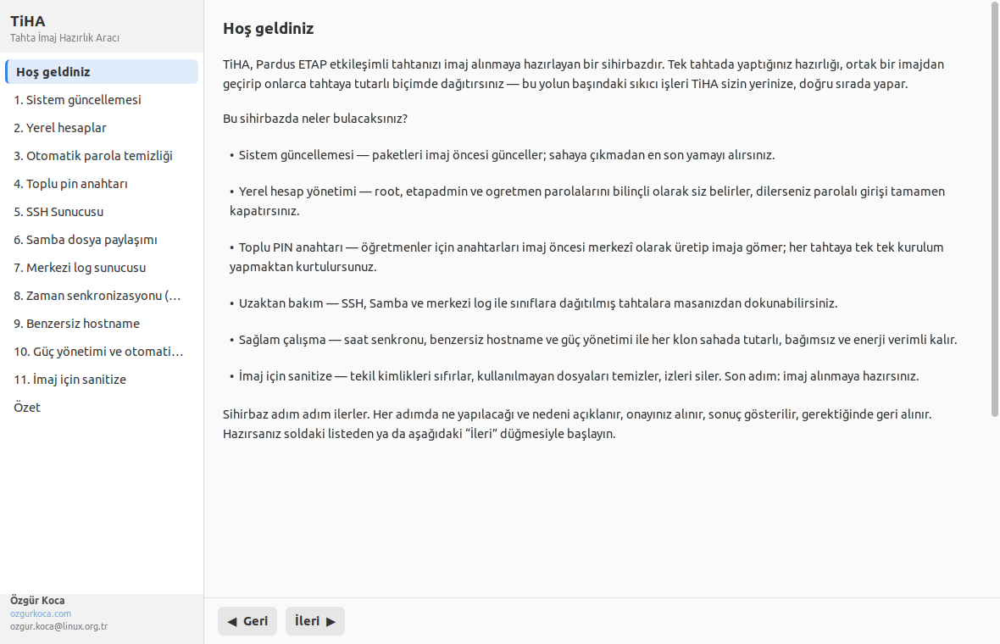</a><br><sub><b>Hoş geldiniz</b> — sihirbazın sunduğu özelliklerin özeti</sub></td>
<td width="50%"><a href="docs/images/02-sistem-guncellemesi.png">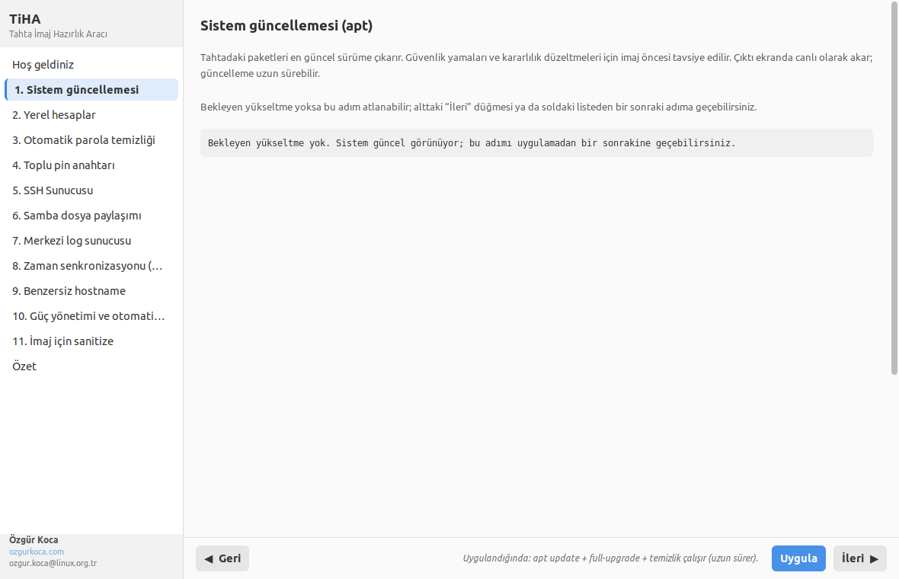</a><br><sub><b>1. Sistem güncellemesi</b> — depo sağlığı + apt zinciri</sub></td>
</tr>
<tr>
<td><a href="docs/images/03-yerel-hesaplar.png">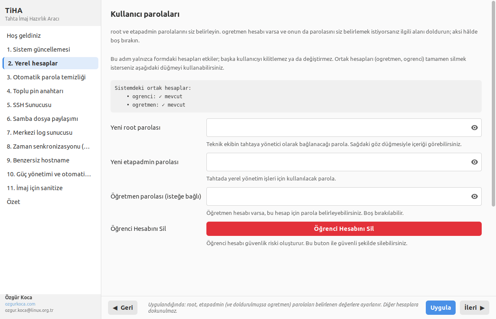</a><br><sub><b>2. Yerel hesaplar</b> — root / etapadmin / ogretmen parolaları</sub></td>
<td><a href="docs/images/04-otomatik-parola-temizligi.png">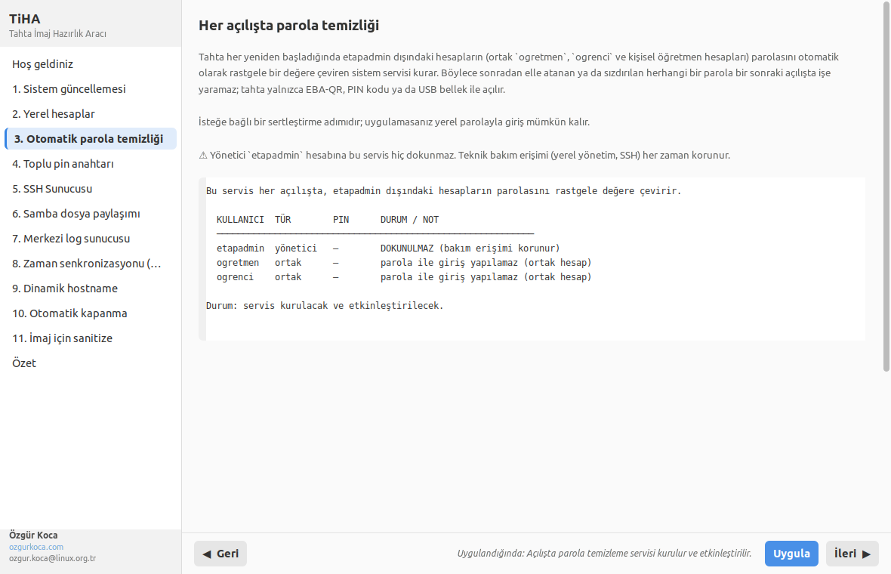</a><br><sub><b>3. Otomatik parola temizliği</b> — açılışta parola sıfırlama servisi</sub></td>
</tr>
<tr>
<td><a href="docs/images/05-toplu-pin-anahtari.png">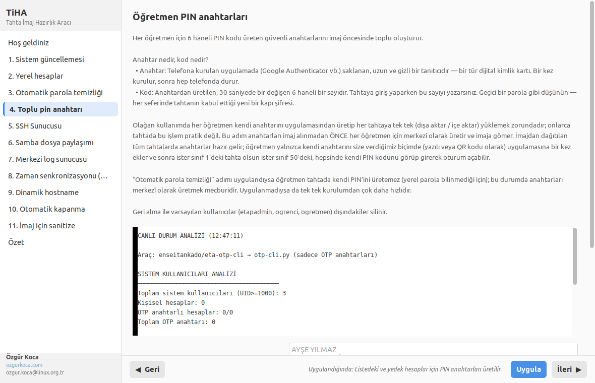</a><br><sub><b>4. Toplu PIN anahtarı</b> — eta-otp-cli ile öğretmen anahtarları</sub></td>
<td><a href="docs/images/06-ssh-sunucusu.png">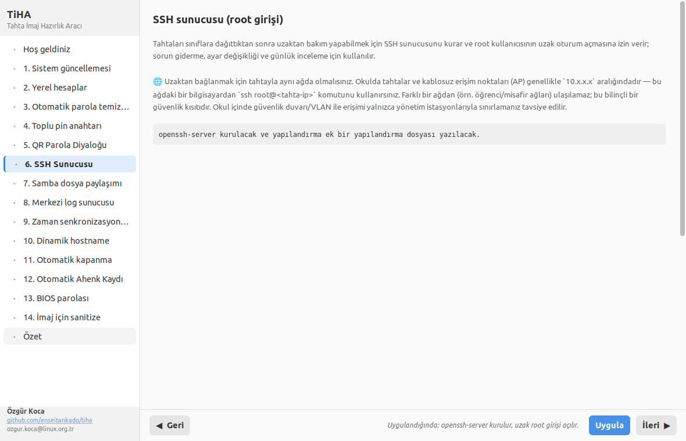</a><br><sub><b>5. SSH Sunucusu</b> — uzaktan terminal erişimi</sub></td>
</tr>
<tr>
<td><a href="docs/images/07-samba-dosya-paylasimi.png">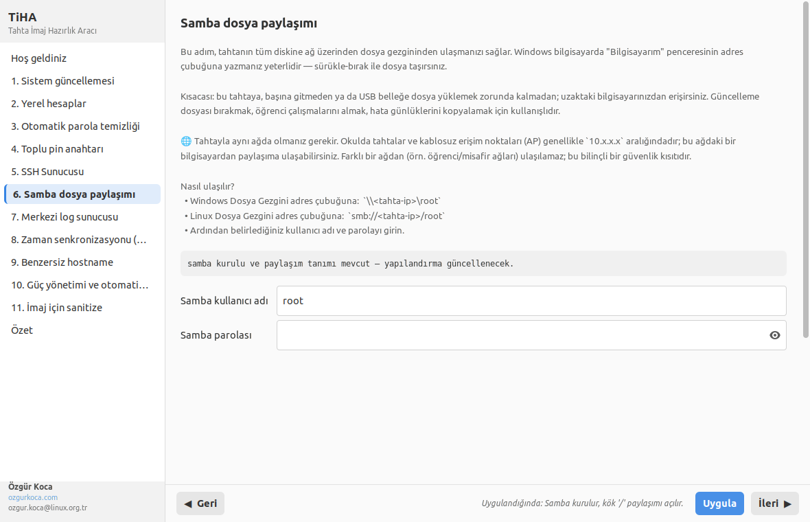</a><br><sub><b>6. Samba dosya paylaşımı</b> — uzak dosya gezgini erişimi</sub></td>
<td><a href="docs/images/08-merkezi-log-sunucusu.png">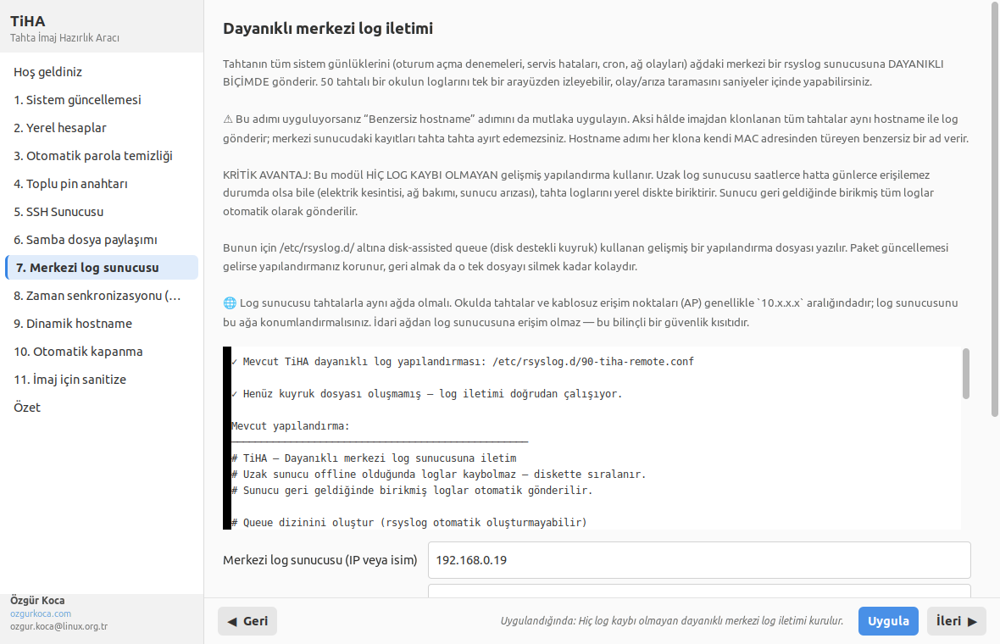</a><br><sub><b>7. Merkezi log sunucusu</b> — disk-assisted queue ile dayanıklı rsyslog</sub></td>
</tr>
<tr>
<td><a href="docs/images/09-zaman-senkronizasyonu.png">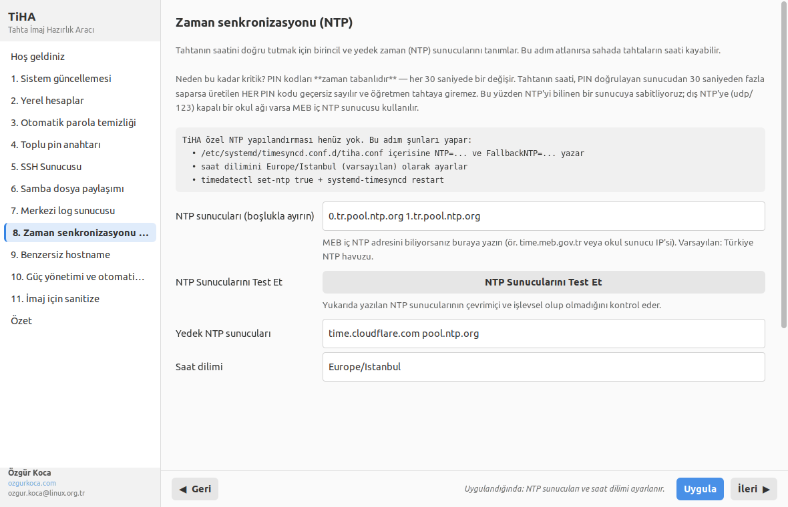</a><br><sub><b>8. Zaman senkronizasyonu (NTP)</b> — canlı test düğmesi dahil</sub></td>
<td><a href="docs/images/10-benzersiz-hostname.png">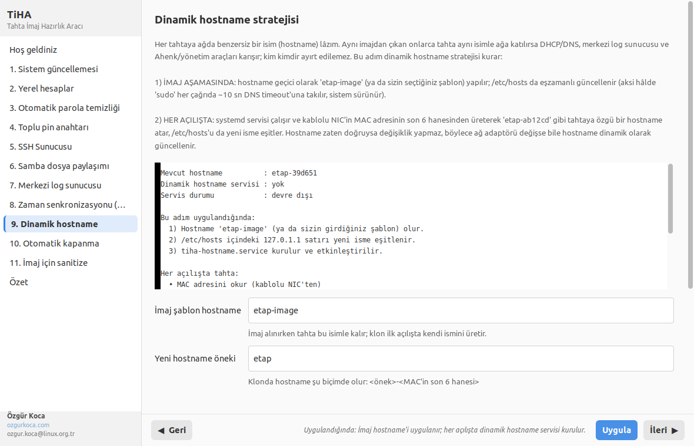</a><br><sub><b>9. Dinamik hostname</b> — her açılışta MAC tabanlı ad</sub></td>
</tr>
<tr>
<td><a href="docs/images/11-guc-yonetimi.png">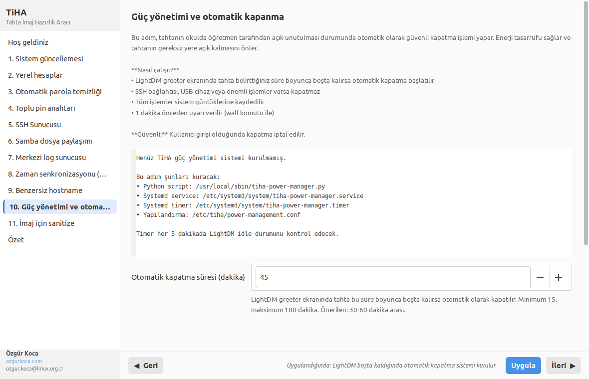</a><br><sub><b>10. Otomatik kapanma</b> — 2 dk uyarı + greeter desteği</sub></td>
<td><a href="docs/images/12-imaj-icin-sanitize.png">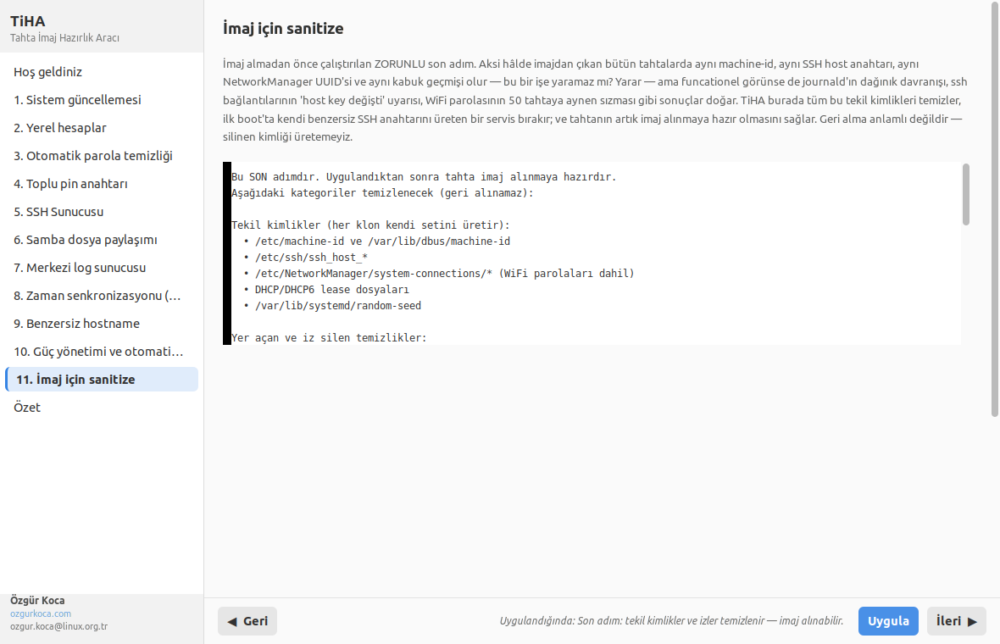</a><br><sub><b>11. İmaj için sanitize</b> — kapsamlı tekil kimlik ve iz temizliği</sub></td>
</tr>
<tr>
<td colspan="2" align="center" width="100%"><a href="docs/images/13-ozet.png">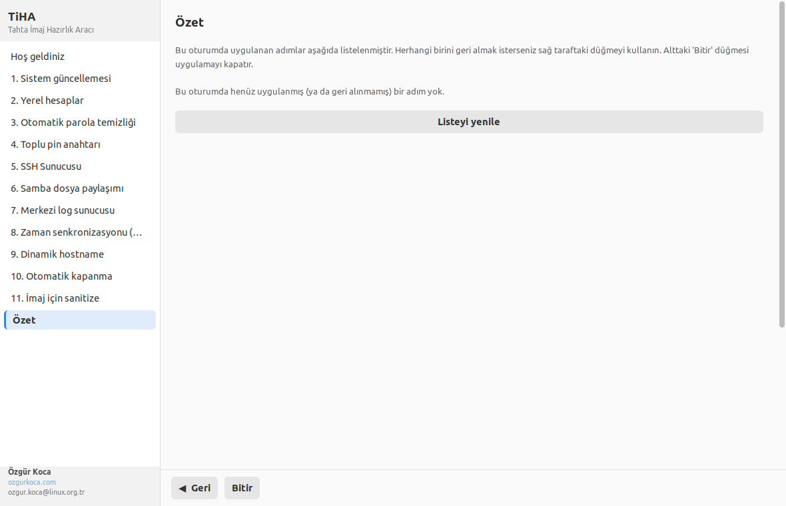</a><br><sub><b>Özet</b> — günce genelinde geri alınabilir durumdaki tüm adımları listeler (önceki oturumlarda uygulanmış olsa bile)</sub></td>
</tr>
<tr>
<td colspan="2" align="center" width="100%"><a href="docs/images/14-otomatik-kapanma-greeter.png">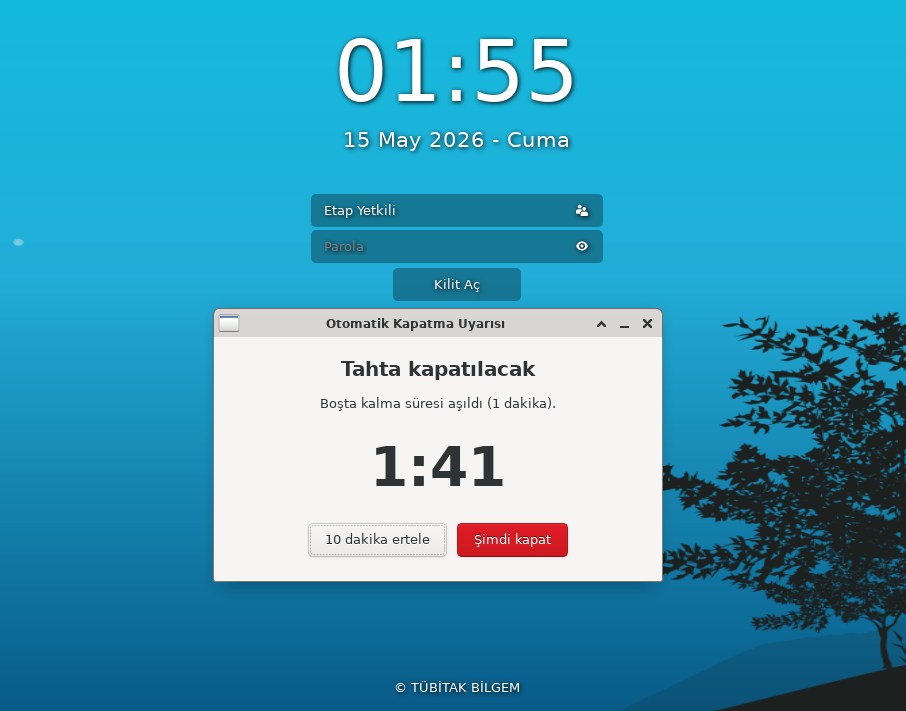</a><br><sub><b>Bonus — Otomatik kapanma uyarısı greeter ekranında</b><br>Kullanıcı login değilken (LightDM giriş ekranında) bile 2 dakikalık geri sayım penceresi gösterilir; "10 dakika ertele" ile şimdilik vazgeçilebilir.</sub></td>
</tr>
</table>

## 📡 Ağ Topolojisi ve Erişim Gereksinimleri

Okulların ağ yapısı genellikle şu şekildedir. **5., 6. ve 7. adımların** (SSH, Samba, Merkezi log) sağladığı özellikler **yalnızca tahta ve AP ağından** kullanılabilir.

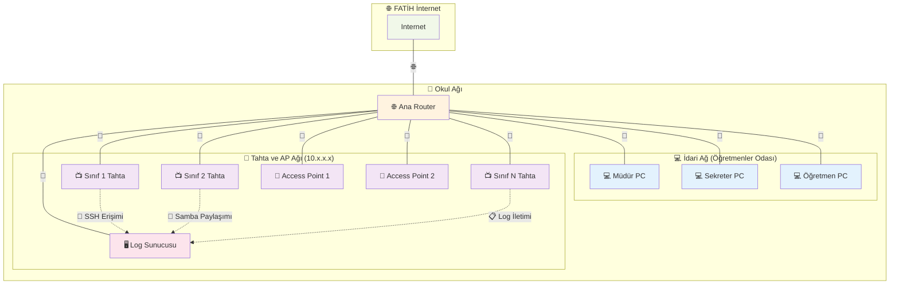

### ⚠️ Önemli Ağ Kısıtları

- **SSH Erişimi** (5. adım): Tahtaya terminal bağlantısı yapabilmek için **tahta ve AP ağında** (`10.x.x.x`) olmak zorunludur.
- **Samba Dosya Paylaşımı** (6. adım): Tahtanın diskine dosya gezgini ile erişebilmek için **tahta ve AP ağında** olmak zorunludur.
- **Merkezi Log İletimi** (7. adım): Log sunucusu **tahta ve AP ağında** konumlandırılmalıdır.

**İdari ağdaki bilgisayarlardan bu özelliklere erişim yoktur.** Teknik destek için laptop/tablet ile **tahta ağına** bağlanmanız veya log sunucusunu **tahta ağına** yerleştirmeniz gerekir.

## Proje yapısı

```
tiha/
├── README.md
├── LICENSE
├── bootstrap.sh                 Tek komutla çalıştıran başlatıcı
├── pyproject.toml
├── data/styles.css              GTK3 teması
└── tiha/                        Python paketi
    ├── app.py                   Uygulama girişi
    ├── core/                    Altyapı (günce, günlük, yetki, yardımcılar, yollar)
    ├── modules/                 Sihirbaz adımları
    └── ui/                      GTK3 arayüzü
```

## Dayandığı projeler

TiHA, "Toplu PIN anahtarı" adımında aşağıdaki açık kaynaklı aracı doğrudan kullanır:

- **[enseitankado/eta-otp-cli](https://github.com/enseitankado/eta-otp-cli)** — Pardus ETAP'ın `/etc/otp-secrets.json` dosyasıyla bire bir uyumlu, terminal tabanlı TOTP/PIN yönetim aracı. Öğretmen listesinden Linux hesaplarını doğru gruplarla oluşturur, her hesap için PIN anahtarı üretir ve giriş ekranında görünür yapar. Yazara ve projeye teşekkürler — bu iş akışını oldukça basitleştirdi.

## ⚠️ Orijinal eta-shutdown servisinin bypass edildiği nokta

**10. adım (Otomatik kapanma)** uygulandığında TiHA, Pardus ETA paketinin sağladığı `eta-shutdown` altyapısını **tamamen kaldırmaz** — `systemd` unit'i (`eta-shutdown.service`), `main.py` ve aynı yapılandırma dosyası (`/etc/pardus/eta-shutdown.conf`) korunur; "ETA Zamanlı Kapatma" GUI'si değişmeden çalışmaya devam eder.

Bypass edilen tek dosya `/usr/share/eta/eta-shutdown/src/service/service.py`'dir: TiHA bu dosyayı, ek özellikler içeren genişletilmiş bir sürümle değiştirir:

- 2 dakikalık GTK geri sayım penceresi (10 dakika erteleme veya "Şimdi kapat" düğmesiyle)
- Aktif grafik oturumun `systemd-logind` (`loginctl`) ile saptanması — kullanıcı login değilse uyarı LightDM greeter ekranında gösterilir
- Çoklu X11 DISPLAY (`:0`, `:1`, `:10`, `:11`) üzerinden idle algılama düzeltmesi

Orijinali aynı dizinde `service.py.tiha-backup` adıyla yedeklenir. 10. adımın "geri al" işlemi yedeği geri yükler ve servisi yeniden başlatır. Ayrıca kullanıcı oturumunda gösterilen geri sayım penceresi `/usr/local/sbin/tiha-shutdown-countdown.py` olarak yazılır; geri al sırasında o da silinir.

<p align="center">
<a href="docs/images/14-otomatik-kapanma-greeter.png"></a><br>
<sub><i>LightDM giriş ekranında etkin geri sayım — kullanıcı login değilken bile uyarı görünür.</i></sub>
</p>

## Sanitize adımının esinlendiği projeler

11. adımdaki yer açma katmanı, açık kaynak temizleyicilerin yaklaşımlarını harmanlar:

- [virt-sysprep](https://libguestfs.org/virt-sysprep.1.html) — sanal makine imajlarını "ilk klon" hâline indirir.
- [cloud-init clean](https://cloudinit.readthedocs.io/) — bulut imaj örneklerinde durum sıfırlama.
- [BleachBit](https://www.bleachbit.org/) — kullanıcı önbellek ve gezinti verisi temizliği.
- Debian'ın kendi `apt-get autoremove --purge` + `apt-get clean` + `journalctl --vacuum-*` araç zinciri.

## Katkı ve destek

- 🐛 Hata bildirimi ve öneri: [GitHub Issues](https://github.com/enseitankado/tiha/issues)
- 💬 Soru ve tartışma: [GitHub Discussions](https://github.com/enseitankado/tiha/discussions)
- Pull request'ler hoş karşılanır; ayrıntılar için [`CONTRIBUTING.md`](CONTRIBUTING.md).

## Lisans

GPL-3.0 — ayrıntı için [`LICENSE`](LICENSE) dosyasına bakınız.

Copyright © 2026 Özgür Koca
