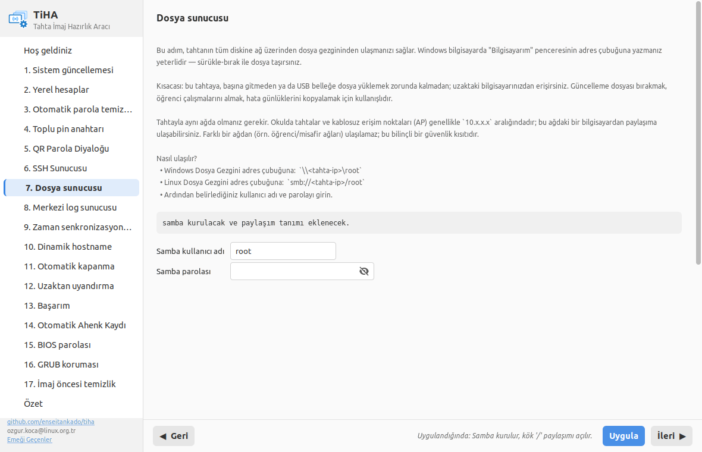
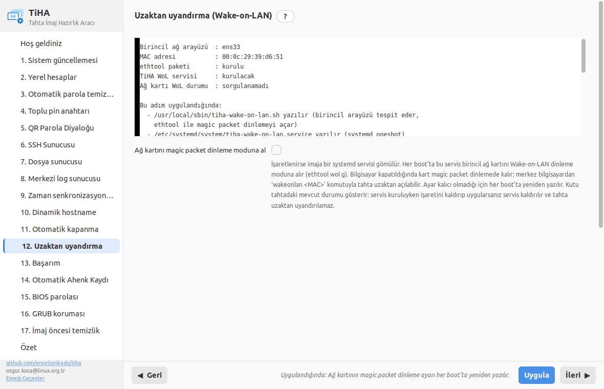
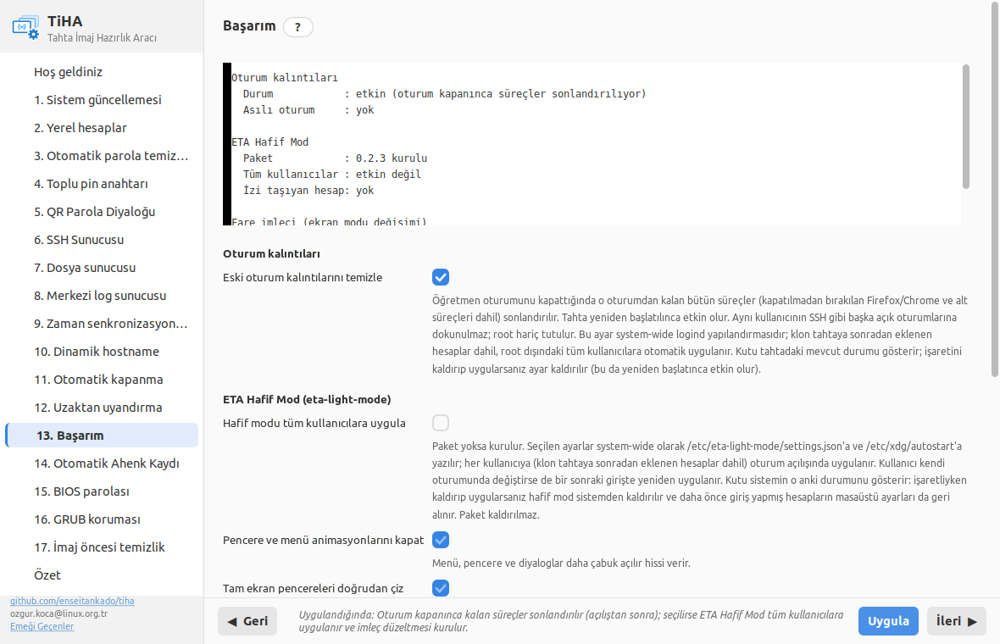
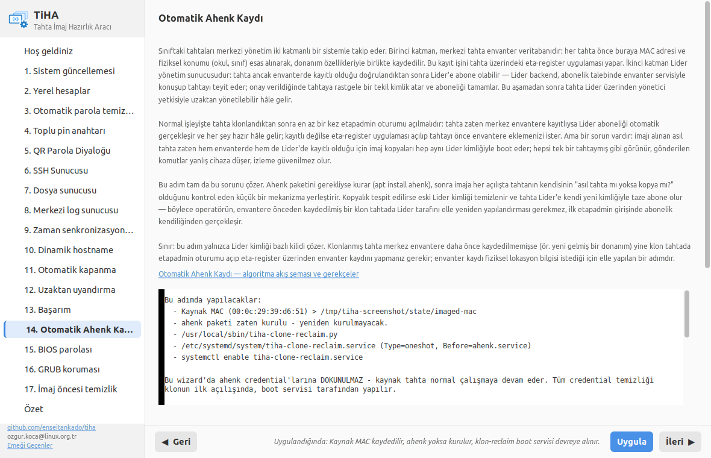
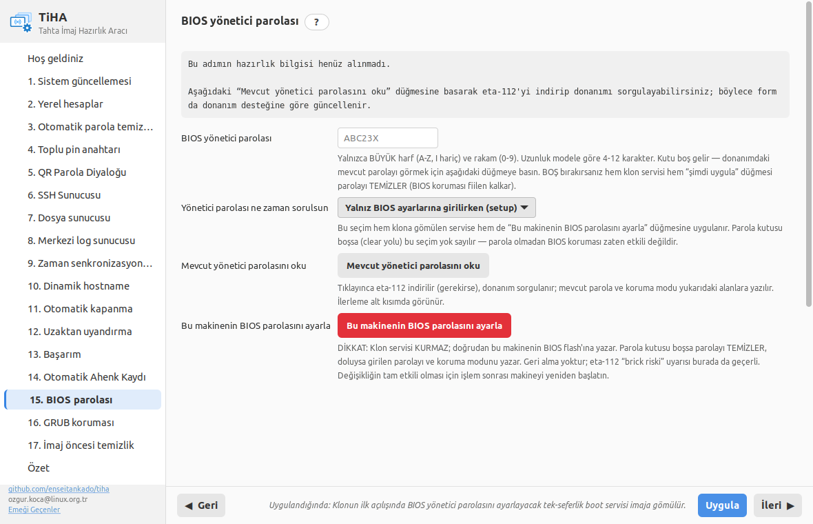
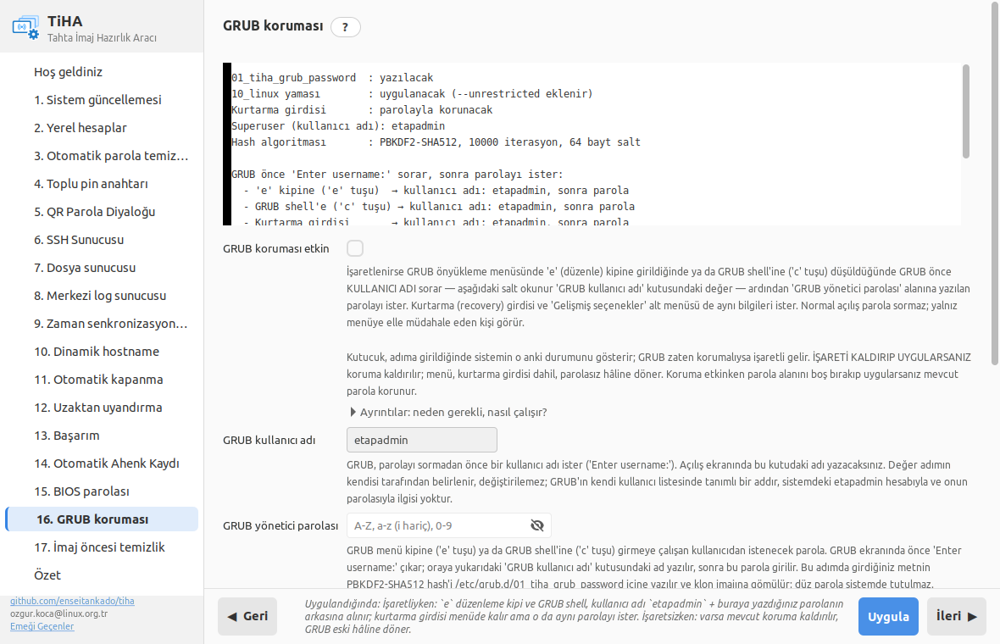
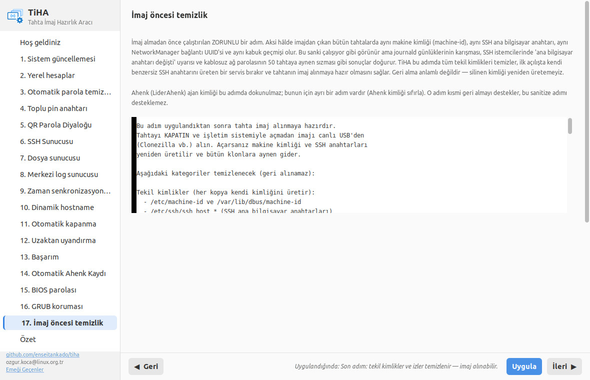
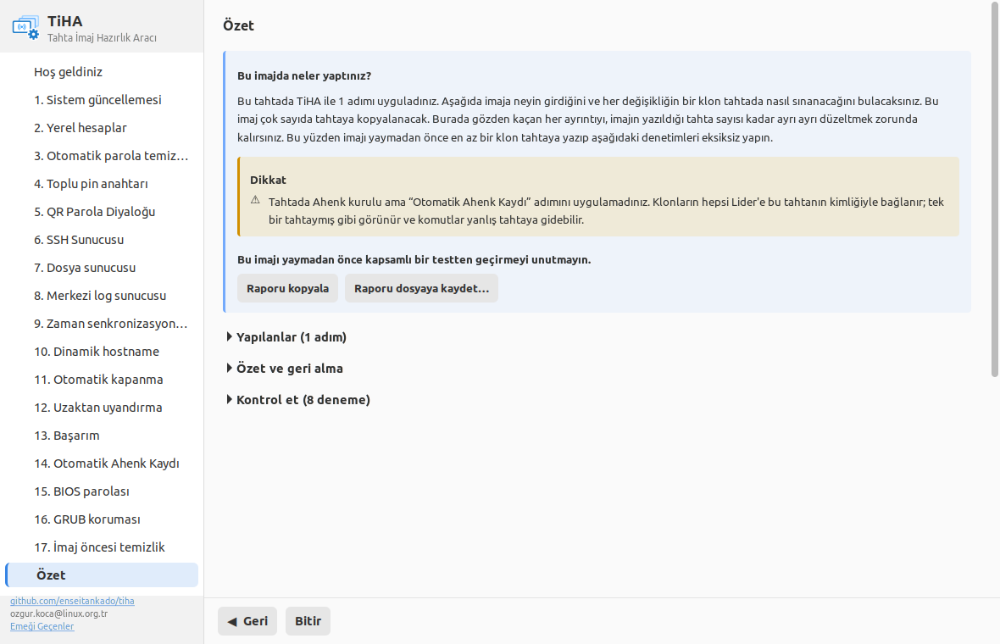
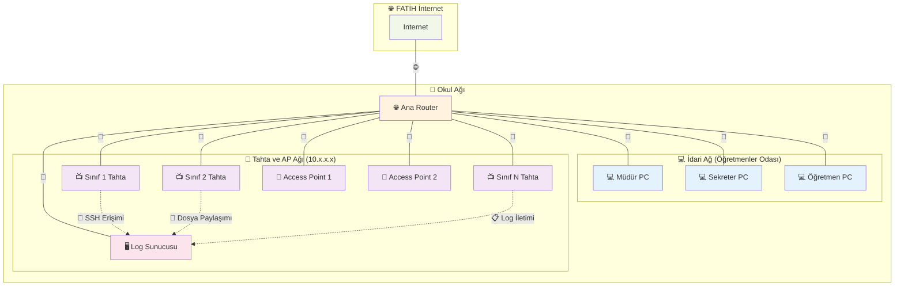

# TiHA — Tahta İmaj Hazırlık Aracı

> Bir sınıf tahtasını baştan sona hazırlayıp imajını alın, o imajı okuldaki bütün tahtalara dağıtın. TiHA bu hazırlığın sıkıcı ve kolay unutulan kısımlarını sizin yerinize, doğru sırayla yapar.

   

---

## TiHA nedir?

Okulunuzda onlarca etkileşimli tahta var ve hepsinin aynı şekilde, eksiksiz hazırlanmasını istiyorsunuz. Hepsini tek tek elden geçirmek hem günler sürer hem de bir yerde mutlaka bir ayar unutulur. TiHA'yla işi tersine çevirirsiniz: tek bir tahtayı güzelce hazırlar, imajını alır, o imajı diğer bütün tahtalara yazarsınız.

Hazırlık dediğimiz şey küçük bir liste değil. Sistemi güncellersiniz; root, etapadmin ve ortak öğretmen hesabının parolalarını koyarsınız; yeni gelecek öğretmenler için yedek hesaplar, okulunuzun türüne göre branş hesapları açarsınız. Öğretmenlerin tahtaya 6 haneli PIN'le girebilmesi için anahtarlar üretip QR kodlu kâğıtlarını yazdırırsınız. Uzaktan bakım için SSH'yi ve dosya sunucusunu, kayıtlar için merkezi log sunucusunu, doğru saat için NTP'yi ayarlarsınız. Unutulan tahtalar akşam kendiliğinden kapansın, sabah ağ üzerinden uyandırılabilsin, eski tahtalar biraz daha hızlı çalışsın istersiniz. BIOS'u ve açılış menüsünü parolayla kilitlersiniz. TiHA bunların hepsini tek bir pencerede, sırasıyla ve ne yaptığını anlatarak yapar.

Asıl püf noktası imajın kendisinde. İmajdan çıkan tahtalar birbirinin tıpatıp kopyasıdır: aynı ad, aynı makine kimliği, aynı SSH anahtarı, Lider'de aynı kayıt. Böyle olunca merkezi yönetim hangisinin hangisi olduğunu bilemez, komutlar yanlış tahtaya gider, kayıtlar birbirine karışır. TiHA bunu da dert olmaktan çıkarır: her klon ilk açılışında kendi adını, kendi anahtarlarını ve Lider'deki kendi kaydını alır.

Sihirbaz her adımda ne yapacağını ve neden yapacağını anlatır, onayınızı alır, sonucu gösterir. Adımların çoğunu **geri alabilirsiniz**. İş bitince Özet sayfası, imaja neyin girdiğini anlatan ve klon tahtada tek tek denemeniz gerekenleri sıralayan yazdırılabilir bir rapor hazırlar. TiHA tahtaya kurulmaz: çalıştırınca açılır, kapatınca iz bırakmadan gider.

## Nasıl çalıştırılır?

1. Tahtada **Etap Yönetici** (`etapadmin`) hesabıyla oturum açın.
2. Uygulamalar menüsünden **Terminal**'i açın.
3. Aşağıdaki komutu **kopyalayıp** terminale **yapıştırın** ve **Enter**'a basın:

```bash
curl -fsSL https://raw.githubusercontent.com/enseitankado/tiha/main/bootstrap.sh | bash
```

İlk çalıştırmada bir kez etapadmin parolanızı sorabilir. Sonrası tamamen görseldir.

## Baştan bilmeniz gerekenler

- **Adımlar isteğe bağlıdır.** Soldaki listeden istediğinize geçebilir, istemediğinizi atlayabilirsiniz. Yalnız sıraya sadık kalmak işinizi kolaylaştırır.
- **"İmaj öncesi temizlik" en sona bırakılır.** O adım geri alınamaz ve tahtayı "imaj alınmaya hazır" hâle getirir. Sonrasında başka bir adım uygularsanız temizliği tekrarlamanız gerekir.
- **Temizlikten sonra tahtayı açmayın.** Kapatın ve imajı canlı USB'den alın. Açarsanız tahta kendine yeni kimlikler üretir ve bunlar bütün klonlara kopyalanır.
- **Parolalar bütün klonlara gider.** Burada belirlediğiniz root, etapadmin, dosya sunucusu, BIOS ve GRUB parolaları imajdaki her tahtada aynıdır. Güçlü seçin ve kimlerle paylaştığınıza dikkat edin.
- **En az bir klonda deneyin.** Gözden kaçan bir ayrıntıyı, imajı yazdığınız tahta sayısı kadar ayrı ayrı düzeltmek zorunda kalırsınız. Son adımdaki Özet sayfası tam olarak bunun için bir kontrol listesi hazırlar.
- **Öğretmen tahtaya ilk kez EBA QR ile girer.** Öğretmenin tahtadaki kişisel hesabı ancak ilk QR girişinde oluşur; PIN ve USB ile giriş ondan sonra çalışır. İnternet yoksa ya da QR çalışmıyorsa öğretmenin elinde yalnız ortak hesap kalır — bu yüzden ortak hesaba bir PIN tanımlamak ya da parolasını paylaşmak gerekir.

## Adımlar

| # | Adım | Ne yapar, nelere dikkat etmelisiniz? |
|---|------|--------------------------------------|
| 1 | **Sistem güncellemesi** | İmajı almadan önce tahtadaki paketleri en güncel hâline getirir. Pardus ETAP 23'te ana depo satırları eksikse yalnız onları ekler; okulun kendi eklediği depolara dokunmaz, başka bir Pardus sürümündeyse depo ayarlarına hiç el sürmeden mevcut depolarla günceller. İnternet ister ve epey sürebilir. Bir şey ters giderse o sorun imajla bütün tahtalara gideceği için, güncellemeden sonra tahtayı biraz kullanıp denemenizde fayda var. |
| 2 | **Yerel hesaplar** | root, etapadmin ve ortak öğretmen hesabının parolasını burada siz belirlersiniz; boş bıraktığınız alana dokunulmaz. Parola değişince o hesabın eski parolayla kilitli anahtarlığını TiHA kenara alır, böylece giriş ekranında "anahtarlık parolası uyuşmuyor" diye takılmazsınız. Okula sonradan gelecek öğretmenler için `ogretmen1`, `ogretmen2`… gibi yedek hesaplar açabilir, okul türünüzü seçip o okulun branşları için (ör. matematik, ingilizce) ayrı hesaplar oluşturabilirsiniz. Yedek ve branş hesapları parolasız açılır, `ogretmenler` grubuna girer; bunlara 4. adımda üretilen PIN'le girilir. Bir branşın işaretini kaldırırsanız ya da yedek hesap sayısını 0'a çekerseniz TiHA size sorar ve onay verirseniz o hesaplar ev dizinleriyle birlikte silinir; bu silme geri alınamaz. Öğrenci hesabını ve varsayılanların dışındaki fazladan hesapları da buradan silebilirsiniz. Ek olarak **EBA QR ile ilk girişte açılan "parola belirleyin" penceresi** (bir kutuyla) varsayılan olarak kapatılır; öğretmen sınıfta, öğrencilerin gözü önünde parola yazmak zorunda kalmasın. İşareti kaldırıp uygularsanız pencere geri gelir. |
| 3 | **Otomatik parola temizliği** | Tahta her açıldığında etapadmin dışındaki bütün hesapların parolasını rastgele bir değere çevirir. Böylece sınıfta tahtaya yazılıp birilerinin gözüne takılan bir parola ertesi gün işe yaramaz. Bunun bedeli şu: bu hesaplara artık **parolayla girilemez**, yalnız EBA QR, PIN ya da USB bellekle girilir. PIN'ler hazır değilse öğretmenler tahtaya giremez, o yüzden önce 4. adımı bitirin. etapadmin'e hiç dokunulmaz, yönetici erişiminiz her zaman yerinde kalır. |
| 4 | **PIN anahtarları** | Öğretmenlerin tahtaya girerken kullanacağı 6 haneli PIN kodlarının anahtarlarını üretip imaja gömer ve her anahtar için QR kodlu, yazdırılabilir bir kâğıt hazırlar. Listeye adını yazdığınız öğretmenlerin yanında yedek hesaplara her zaman, "Öğretmen hesapları için de PIN üret" işaretliyse ortak öğretmen hesabına, EBA QR ile açılmış hesaplara ve branş hesaplarına da anahtar üretilir. Daha önce üretilmiş anahtarlara dokunulmaz; adımı yeniden uygulamak öğretmenin telefonundaki kaydı bozmaz. İsterseniz `ogretmenler` grubunun tamamının kullanabileceği ortak bir PIN de oluşturabilirsiniz; ama gruptaki herkes aynı kodu kullandığı için tek tek PIN'lerden daha zayıftır ve ortak öğretmen hesabında geçmez. Kâğıtlar ve anahtarlar gizlidir, öğretmenlere özelden teslim edin. |
| 5 | **SSH Sunucusu** | Tahtaya ağ üzerinden terminalle bağlanıp uzaktan bakım yapmanızı sağlar. Giriş root parolasıyla yapılır; bu yüzden 2. adımda root parolasını belirlemeniz gerekir, yoksa kimse bağlanamaz. Aynı parola bütün tahtalarda geçerli olacağından erişimi okul ağıyla sınırlamak iyi olur. Yalnız tahtaların bulunduğu ağdan erişilir (aşağıdaki ağ bölümüne bakın). |
| 6 | **Dosya sunucusu** | Tahtanın diskine Windows ya da Linux'taki dosya gezgininden erişip dosya alıp vermenizi sağlar. Bunu yaparken tahtanın tamamını yazma yetkisiyle paylaşıma açar; paylaşım parolasını dikkatli seçin ve erişimi yönetim bilgisayarlarıyla sınırlayın. Bu da yalnız tahta ağından çalışır. |
| 7 | **Merkezi log sunucusu** | Tahtaların kayıtlarını okuldaki merkezi sunucuya gönderir; sunucu kapalıyken kayıtlar tahtada birikir, sunucu dönünce kaybolmadan gönderilir. Hangi kayıtların gideceğini profille seçersiniz; her şeyi gönderen "Kapsamlı" profil sorun ayıklamak içindir, kalıcı açık bırakmayın. İsterseniz disk sağlığı ve sıcaklık takibi de kurulur. **9. adımı da mutlaka uygulayın**, yoksa sunucuda hangi kaydın hangi tahtadan geldiğini ayırt edemezsiniz. |
| 8 | **Zaman senkronizasyonu (NTP)** | Tahtanın saatini doğru tutar. Bu sandığınızdan önemli: PIN kodları saate bağlıdır, saat kayarsa öğretmenler PIN'le giremez. Okul ağı dışarıya kapalıysa kendi NTP sunucunuzun adresini yazın ve test düğmesiyle deneyin. |
| 9 | **Dinamik hostname** | Her tahtanın ağda kendine özgü bir adı olmasını sağlar. İmaj alınırken ortak bir ad kullanılır; imajdan çıkan her tahta açılışta adını kendi ağ kartının adresinden üretir. Log sunucusunda, envanterde ve uzaktan bağlanırken tahtaları birbirinden ayırt etmenin tek yolu budur. |
| 10 | **Otomatik kapanma** | Unutulan tahtayı belirlediğiniz saatte ya da belli bir süre kullanılmadığında kapatır. Kapatmadan önce ekranda bir geri sayım gösterir, süresini siz seçersiniz; kullanıcı kapanmayı 10 dakika erteleyebilir. Ekran, seçtiğiniz kullanılmama süresinden önce kararıyorsa uyarı kararmış ekranın arkasında kalabilir; adım bunu size söyler. Bazı tahtaların hiç kapanmamasını istiyorsanız MAC adreslerini listeye yazmanız yeterli. İki seçeneği de kapatıp uygularsanız otomatik kapanma kapatılır. Sayfanın başında tahtanın mevcut güç ayarlarını da görürsünüz. |
| 11 | **Uzaktan uyandırma** | Kapalı tahtayı ağ üzerinden açabilmenizi sağlar; sabah bütün sınıfları merkezden açabilirsiniz. Yalnız tahtanın işletim sistemi tarafını hazırlar: her tahtanın BIOS'unda Wake on LAN açık, ErP ve Deep Sleep kapalı olmalı ve BIOS ayarları imajla taşınmadığı için bunları tek tek yapmanız gerekir. Ethernet kablosu takılı olmalı. Kutunun işaretini kaldırıp uygularsanız servis kaldırılır. |
| 12 | **Başarım** | Tahtayı biraz daha çevik hâle getirir. Kapatılan oturumdan arta kalıp belleği işgal eden programları temizler; isterseniz animasyonları kapatan, çözünürlüğü ve yenileme hızını düşüren ETA Hafif Mod'u bütün kullanıcılara uygular. Ekran modu değişince fare imlecinin kaybolmasını önleyen iki deneysel ayar da vardır: ekran sürücüsü değişikliği (modesetting, istenirse yazılımsal imleç) ve imleci tazeleyen küçük bir servis; hangisinin işe yaradığı tahta modeline göre değişir, klonda deneyin. Hafif mod görüntüyü belirgin biçimde değiştirebilir (kalem çizgisi bulanıklaşabilir, bazı programlar farklı görünebilir); klonlamadan önce sınıfta kullanılan yazılımlarla deneyin. Değişiklikler bir sonraki açılışta devreye girer. [Ayrıntı](docs/m17-basarim-deneysel.md) |
| 13 | **Otomatik Ahenk Kaydı** | Klon tahtaların merkezi yönetime (Lider) kaynak tahtanın değil, kendi kimlikleriyle kaydolmasını sağlar; bu adım olmadan bütün klonlar tek bir tahtaymış gibi görünür ve komutlar yanlış tahtaya gider. Tahtanın merkezi envanterde kayıtlı olması gerekir: kayıtlıysa klon ilk açılışta kendiliğinden abone olur, değilse klonda etapadmin ile oturum açıp kayıt uygulamasını çalıştırırsınız. [Ayrıntı](docs/m12-clone-reclaim.md) |
| 14 | **BIOS parolası** | Klonların BIOS'una ilk açılışta yönetici parolası koyar, böylece kimse USB'den başka bir sistem açamaz. Yalnız desteklenen tahta modellerinde çalışır; desteklenmeyen donanımda adım "uygulanamaz" diye işaretlenir, hata sayılmaz. Parolayı unutursanız BIOS'a giremezsiniz. Parola alanını boş bırakıp uygularsanız koruma kalkar. |
| 15 | **GRUB koruması** | Açılış menüsünün kurcalanmasını engeller: menüyü düzenlemeye ya da kurtarma kipine girmeye çalışan kişiden kullanıcı adı ve parola istenir, normal açılış ise hiçbir şey sormaz. Bu koruma olmadan tahtanın başına oturan biri açılış menüsünden yönetici hakkı alabilir. Kullanıcı adı `etapadmin`'dir ama parola sistemdeki etapadmin parolası değil, burada belirlediğinizdir; unutursanız kurtarma kipine giremezsiniz. Açılış ekranında klavye İngilizce düzende çalıştığı için parola en az 8 karakter olmalı ve yalnız büyük harfler, küçük i dışındaki küçük harfler ve rakamlardan oluşabilir. Kutunun işaretini kaldırıp uygularsanız koruma kalkar. |
| 16 | **İmaj öncesi temizlik** | Tahtayı imaj alınmaya hazırlar: tahtaya özgü kimlikleri sıfırlar, kullanım izlerini ve gereksiz dosyaları siler, genelde 500 MB ile 1 GB arası yer açar. Kablosuz ağ parolaları, tarayıcı geçmişi ve çerezleri, çöp kutusu, kayıtlı parola anahtarlıkları ve TiHA'nın yedekleri silinir; yer imleri kalır. **Geri alınamaz**, ve TiHA'nın yedekleri gittiği için 2. ve 4. adımlar da bu noktadan sonra geri alınamaz. En sona bırakın, sonra tahtayı **açmadan** kapatıp imajı alın. |

## Özet sayfası ve rapor

Son adımdan sonra Özet sayfası, imaja tam olarak neyin girdiğini anlatan bir rapor hazırlar. Rapor üç bölümden oluşur: **Yapılanlar**, adımlar arası **Dikkat** uyarıları (ör. temizlikten sonra değişiklik yaptıysanız sizi uyarır) ve klon tahtada tek tek denemeniz gereken maddelerden oluşan **Kontrol et** listesi.

Raporu panoya kopyalayabilir ya da yazdırmaya uygun bir dosya olarak kaydedebilirsiniz. Kaydedilen dosyayı tarayıcıda açıp yazdırırsanız kontrol maddeleri kutucuklu çıkar; klon tahtayı denerken elinizde işaretleyebileceğiniz bir liste olur. Aynı sayfadan, geri alınabilir adımları tek tek geri alabilirsiniz. [Raporun ayrıntısı](docs/ozet-raporu.md)

## Sihirbazdan kareler

<table>
<tr>
<td width="50%"><a href="docs/images/00-hosgeldiniz.png"></a><br><sub><b>Hoş geldiniz</b> — adımların listesi ve akışın özeti</sub></td>
<td width="50%"><a href="docs/images/01-sistem-guncellemesi.png"></a><br><sub><b>1. Sistem güncellemesi</b></sub></td>
</tr>
<tr>
<td><a href="docs/images/02-yerel-hesaplar.png"></a><br><sub><b>2. Yerel hesaplar</b> — parolalar, yedek ve branş hesapları</sub></td>
<td><a href="docs/images/03-otomatik-parola-temizligi.png"></a><br><sub><b>3. Otomatik parola temizliği</b></sub></td>
</tr>
<tr>
<td><a href="docs/images/04-toplu-pin-anahtari.png"></a><br><sub><b>4. PIN anahtarları</b> — öğretmen PIN'leri ve yazdırılabilir kâğıt</sub></td>
<td><a href="docs/images/05-eba-qr-parola-diyalogu.png"></a><br><sub><b>5. QR Parola Diyaloğu</b> — sınıfta parola yazma zorunluluğunu kaldırır</sub></td>
</tr>
<tr>
<td><a href="docs/images/06-ssh-sunucusu.png"></a><br><sub><b>6. SSH Sunucusu</b> — uzaktan bakım</sub></td>
<td><a href="docs/images/07-dosya-sunucusu.png"></a><br><sub><b>7. Dosya sunucusu</b> — ağ üzerinden dosya alıp verme</sub></td>
</tr>
<tr>
<td><a href="docs/images/08-merkezi-log-sunucusu.png"></a><br><sub><b>8. Merkezi log sunucusu</b> — kayıtlar kaybolmadan toplanır</sub></td>
<td><a href="docs/images/09-zaman-senkronizasyonu.png"></a><br><sub><b>9. Zaman senkronizasyonu</b> — test düğmesi dahil</sub></td>
</tr>
<tr>
<td><a href="docs/images/10-dinamik-hostname.png"></a><br><sub><b>10. Dinamik hostname</b> — her tahtaya kendi adı</sub></td>
<td><a href="docs/images/11-otomatik-kapanma.png"></a><br><sub><b>11. Otomatik kapanma</b> — geri sayım, erteleme ve muaf tahtalar</sub></td>
</tr>
<tr>
<td><a href="docs/images/12-uzaktan-uyandirma.png"></a><br><sub><b>12. Uzaktan uyandırma</b> — tahtaları ağ üzerinden açma</sub></td>
<td><a href="docs/images/13-basarim.png"></a><br><sub><b>13. Başarım</b> — oturum kalıntıları ve ETA Hafif Mod</sub></td>
</tr>
<tr>
<td><a href="docs/images/14-otomatik-ahenk-kaydi.png"></a><br><sub><b>14. Otomatik Ahenk Kaydı</b> — klonlar kendi kimliğiyle kaydolur</sub></td>
<td><a href="docs/images/15-bios-yonetici-parolasi.png"></a><br><sub><b>15. BIOS parolası</b> — klonda ilk açılışta ayarlanır</sub></td>
</tr>
<tr>
<td><a href="docs/images/16-grub-korumasi.png"></a><br><sub><b>16. GRUB koruması</b> — açılış menüsü ve kurtarma kipi parolalı</sub></td>
<td><a href="docs/images/17-imaj-oncesi-temizlik.png"></a><br><sub><b>17. İmaj öncesi temizlik</b> — kimlikleri ve izleri siler</sub></td>
</tr>
<tr>
<td><a href="docs/images/18-ozet.png"></a><br><sub><b>Özet</b> — imaj raporu ve geri alma</sub></td>
<td></td>
</tr>
<tr>
<td colspan="2" align="center" width="100%"><a href="docs/images/bonus-greeter-countdown.png"></a><br><sub><b>Otomatik kapanma uyarısı giriş ekranında</b><br>Kimse oturum açmamışken bile geri sayım görünür; "10 dakika ertele" ile vazgeçilebilir.</sub></td>
</tr>
</table>

## Ağ: neyin nereden çalıştığı

Okul ağı genellikle ikiye ayrılır: öğretmenler odasındaki idari bilgisayarlar ve tahtaların bağlı olduğu ağ. **SSH (6), Dosya sunucusu (7) ve Merkezi log (8)** yalnızca **tahtaların bulunduğu ağdan** çalışır.


```mermaid
graph TB
    subgraph "🌐 FATİH İnternet"
        I[Internet]
    end

    subgraph "🏫 Okul Ağı"
        R[🌐 Ana Router]

        subgraph "💻 İdari Ağ (Öğretmenler Odası)"
            direction TB
            A1[💻 Müdür PC]
            A2[💻 Sekreter PC]
            A3[💻 Öğretmen PC]
        end

        subgraph "📱 Tahta ve AP Ağı (10.x.x.x)"
            direction TB
            T1[📺 Sınıf 1 Tahta]
            T2[📺 Sınıf 2 Tahta]
            T3[📺 Sınıf N Tahta]
            AP1[📡 Access Point 1]
            AP2[📡 Access Point 2]
            LS[🖥️ Log Sunucusu]
        end
    end

    I ---|🌐| R
    R ---|🔗| A1
    R ---|🔗| A2
    R ---|🔗| A3
    R ---|🔗| T1
    R ---|🔗| T2
    R ---|🔗| T3
    R ---|🔗| AP1
    R ---|🔗| AP2
    R ---|🔗| LS

    T1 -.->|🔧 SSH Erişimi| LS
    T2 -.->|📁 Dosya Paylaşımı| LS
    T3 -.->|📋 Log İletimi| LS

    classDef admin fill:#e3f2fd
    classDef tahta fill:#f3e5f5
    classDef internet fill:#f1f8e9
    classDef router fill:#fff3e0
    classDef logserver fill:#fce4ec

    class A1,A2,A3 admin
    class T1,T2,T3,AP1,AP2 tahta
    class I internet
    class R router
    class LS logserver
```

**İdari ağdaki bilgisayarlardan bu üç özelliğe erişilemez.** Teknik destek için dizüstü bilgisayarınızla tahta ağına bağlanmanız, log sunucusunu da tahta ağına koymanız gerekir.

## Ekrandaki yazıları değiştirmek

Sihirbazda gördüğünüz bütün yazılar tek bir dosyada toplanmıştır: `tiha/locale/tr.toml`. Bir açıklamayı okulunuza göre değiştirmek isterseniz dosyayı açıp yazıyı düzenlemeniz yeterli; dosyanın başında nelere dikkat edileceği yazıyor. Aynı dosyanın çevrilmiş bir kopyasıyla sihirbaz başka bir dilde de çalıştırılabilir.

## Yapılacaklar

- **Uzaktan uyandırma adımına BIOS WoL bayrağını açan bir özellik eklenecek.** Bu adım şu anda yalnız işletim sistemi tarafını hazırlıyor; kart uyandırılabilmek için tahtanın BIOS setup ekranında **Wake on LAN** seçeneğinin (ve buna bağlı **ErP** / **Deep Sleep** kapalı ayarlarının) etkin olması gerekiyor. Şu an bunu her tahtada elle yapıyorsunuz. Planlanan geliştirme: klon makinede BIOS setup'taki WoL bayrağını `eta-112` üzerinden (destekleyen modellerde) otomatik açacak bir alt-akış.

## Hata raporları

TiHA'da beklenmeyen bir hata oluşursa geliştiriciye kısa, **anonim** bir hata raporu gönderilir (ntfy.sh üzerinden). Raporda yalnız hata türü, TiHA'nın kendi kodundaki hata yeri, hangi adımda olduğu ve TiHA/Pardus sürümü bulunur. Bilgisayar adı, kullanıcı ve öğretmen adları, parolalar, anahtarlar, IP/MAC/e-posta adresleri ve günlük dosyaları **gönderilmez**; hata iletisindeki bu tür bilgiler gönderilmeden önce maskelenir. Aynı hata bir tahtadan günde bir kez gider. Kapatmak için tahtada `sudo touch /etc/tiha/hata-raporu-kapali` komutunu çalıştırın ya da TiHA'yı `TIHA_HATA_RAPORU=0` ortam değişkeniyle başlatın.

## Katkı ve destek

- Hata bildirimi ve öneri: [GitHub Issues](https://github.com/enseitankado/tiha/issues)
- Soru ve tartışma: [GitHub Discussions](https://github.com/enseitankado/tiha/discussions)
- Pull request'ler hoş karşılanır; ayrıntılar için [`CONTRIBUTING.md`](CONTRIBUTING.md).

Teknik ayrıntılar ve tasarım kararları `docs/` klasöründedir.

## Teşekkür

Öğretmen PIN'leri adımı [enseitankado/eta-otp-cli](https://github.com/enseitankado/eta-otp-cli) aracını kullanır; BIOS parolası adımı [enseitankado/eta-112](https://github.com/enseitankado/eta-112) ile çalışır. TiHA'nın dayandığı bütün projeler, sihirbazın sol alt köşesindeki **Emeği Geçenler** penceresinde lisanslarıyla birlikte listelenir.

## Lisans

GPL-3.0 — ayrıntı için [`LICENSE`](LICENSE) dosyasına bakınız.

Copyright © 2026 Özgür Koca
