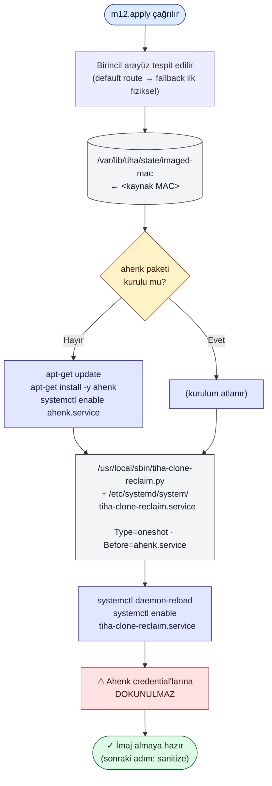
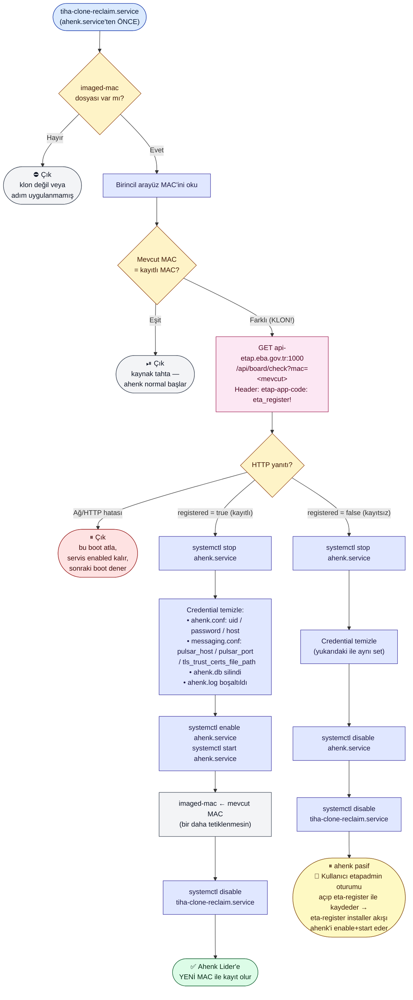

# 12. Adım — Klon-yeniden-talep (Ahenk)

Bu belge, TiHA'nın 12. adımı `m12_ahenk_reset` (sihirbazda **"Klon Yeniden
Talep"**) ile imaja gömülen *klon tespiti + Ahenk yeniden talep* akışını
açıklar.

> Bu adımın amacı, klonlanmış tahtaların aynı Pardus/LiderAhenk
> credential'larıyla MEB Pulsar broker'ına bağlanıp Lider sunucusunda
> tek bir tahtanın yönetilebilir olmasına yol açan **kimlik çakışmasını
> kalıcı olarak çözmektir**.

## Sorunun özeti

ETAP tahtalarındaki **ahenk** ajanı (LiderAhenk istemcisi) ilk
çalıştırıldığında MEB backend'inden bir UID + parola alır ve bu
credential'ları `/etc/ahenk/ahenk.conf` + `/etc/ahenk/ahenk.db` içinde
yerel olarak saklar. Bir tahtanın imajını alıp 100 tahtaya kopyalarsanız,
**100 tahta da aynı UID + parola ile Pulsar'a bağlanır**:

- Pulsar Exclusive consumer çakışması yaşar → yalnızca bir tane bağlantı
  aktif kalır, diğerleri kaybedilir.
- Cross-board impersonation: Lider'de bir tahtaya gönderilen komut başka
  bir tahtaya düşer.

**Çözüm**: her klon ilk açıldığında ahenk credential'ları sıfırlanmalı,
ahenk yeniden başlatılıp Lider'e **kendi MAC adresiyle** kayıt akışına
girmeli. TiHA bunu klon makinede *otomatik*, kullanıcı müdahalesi
gerektirmeden yapmaya çalışır.

## Akış şeması

Üç ayrı diyagramla bakıyoruz: (1) baştan sona zamansal akış, (2) wizard
zamanı (kaynak tahta), (3) klon ilk açılış (boot servisi).

### 1) Üst düzey zaman akışı

```mermaid
flowchart LR
    A["📀 Kaynak tahta<br/>wizard çalışıyor"]:::src
    B["🧷 m12 apply<br/>(klon-yeniden-talep<br/>mekanizmasını imaja göm)"]:::step
    C["🧹 Sanitize adımı<br/>(son adım)"]:::step
    D[("💾 Disk imajı alınır<br/>Clonezilla vb.")]:::media
    E["🖥️🖥️🖥️<br/>N adet klon tahta<br/>(imaj uygulandı)"]:::clones
    F["🔄 Her klonda<br/>ilk açılışta:<br/>tiha-clone-reclaim.service"]:::boot
    G(["✅ Klonlar Lider'e<br/>kendi MAC'leriyle<br/>kayıt olur"]):::done

    A --> B --> C --> D --> E --> F --> G

    classDef src    fill:#dbeafe,stroke:#1e40af,color:#0b1a3a
    classDef step   fill:#e0e7ff,stroke:#3730a3,color:#1e1b4b
    classDef media  fill:#fef3c7,stroke:#92400e,color:#451a03
    classDef clones fill:#ede9fe,stroke:#6d28d9,color:#2e1065
    classDef boot   fill:#cffafe,stroke:#0e7490,color:#083344
    classDef done   fill:#dcfce7,stroke:#166534,color:#052e16
```

### 2) Wizard tarafı — m12.apply (kaynak tahta)

### 3) Boot servisi — klonun ilk açılışı (her açılışta çalışır)

## Bileşenler

### Wizard tarafı (m12 apply zamanında)

| Bileşen | Konum |
|---|---|
| **MAC imzası** | `/var/lib/tiha/state/imaged-mac` (kaynak tahtanın birincil arayüz MAC'i) |
| **Boot betiği** | `/usr/local/sbin/tiha-clone-reclaim.py` (Python 3) |
| **systemd unit** | `/etc/systemd/system/tiha-clone-reclaim.service` (Type=oneshot, Before=ahenk.service) |
| **ahenk paketi** | TiHA yüklü değilse `apt-get install -y ahenk` ile kurar; `ahenk.service` enable edilir |

> Önemli: wizard zamanında **ahenk credential'larına dokunulmaz**.
> `ahenk.conf` (uid/password/host), `messaging.conf` (Pulsar alanları),
> `ahenk.db`, `ahenk.log` aynen kalır. Tüm sıfırlama klon makinede,
> ilk boot'ta, boot servisi tarafından yapılır.

### Boot servisi mantığı (her açılışta)

`tiha-clone-reclaim.service`'in tetiklediği `tiha-clone-reclaim.py`:

1. `imaged-mac` dosyası yoksa → çık.
2. Birincil arayüzün MAC'ini al (default route → fallback ilk fiziksel
   arayüz).
3. Mevcut MAC == imaged-mac → çık (kaynak tahtanın kazara reboot'u).
4. MAC değişti → klon!
   - `GET /api/board/check?mac=<mevcut>` (ETAP backend; eta-register
     ile aynı endpoint + header).
   - Ağ/HTTP hatası → çık, servis enabled kalır, sonraki boot dener.
   - **Kayıtlı**:
     - `systemctl stop ahenk.service`
     - Credential sıfırlama:
       - `ahenk.conf`: `uid`, `password`, `host` alanları boşaltılır
       - `messaging.conf`: `pulsar_host`, `pulsar_port`,
         `tls_trust_certs_file_path` boşaltılır
       - `ahenk.db` silinir
       - `ahenk.log` boşaltılır
     - `systemctl enable ahenk.service`
     - `systemctl start ahenk.service`
     - `imaged-mac` ← mevcut MAC (sonraki boot'larda tetiklenmesin)
     - Boot servisi kendini disable eder
   - **Kayıtsız**:
     - `systemctl stop ahenk.service`
     - Credential'lar yine silinir (Pulsar'da sahte kimlikle bağlanmasın)
     - `systemctl disable ahenk.service`
     - Boot servisi kendini disable eder
     - Kullanıcı etapadmin oturumu açıp eta-register ile tahtayı
       kaydeder; o akışın sonunda ahenk otomatik enable + start edilir
       (eta-register'ın `installer.py` zaten bunu yapıyor)

## Tasarım gerekçeleri

### Neden credential temizliği wizard'da değil boot'ta?

- **Kaynak tahta sanitize'a kadar normal çalışır**: imaj alma süreci
  uzun olabilir, kaynağın Lider bağlantısı kesilirse uzaktan yönetim
  / izleme imkânı kaybedilir.
- **Klon ilk boot'ta API ile teyit alır**: backend'de kayıtlı mı diye
  sorar. Eğer backend kayıt görmediyse credential'ları silsek de ahenk
  yeniden kayıt yapamaz; o zaman ahenk'i durdurup kullanıcıyı
  bilgilendiren temiz bir state'e geçeriz.

### Neden `Before=ahenk.service`?

ahenk daemon başladığında credential dosyalarını okuyup Pulsar'a hemen
bağlanmaya çalışır. Eğer biz ahenk'ten sonra çalışırsak (After=)
ahenk eski credential'larla Pulsar'a bağlanmış olur → çakışma. Before=
ile systemd bizi ahenk'ten önce başlatır; biz biter bitmez ahenk
başlar — ya yeni temiz credential ile (kayıtlı klon) ya da disable
olmuş halde (kayıtsız klon) hiç başlamaz.

### Neden API sorgusu yapıyoruz?

Klonun backend'e zaten kayıtlı olduğunu doğrulamadan ahenk
credential'larını silip yeniden başlatırsak, ahenk Lider'e POST register
atar ama backend kayıt görmediği için reddeder. Sonuç: ahenk
not_authorized alır, durur. Bu uçuk bir state — kullanıcı zaten manuel
müdahale etmek zorunda kalır. API sorgusunu boot servisinde yapmak
"kayıtlıysa otomatik tamam, değilse kullanıcıyı bilgilendir" akışını
verir.

### Neden kayıtsız klonda da credential siliyoruz?

Aksi takdirde ahenk eski (kaynak tahtanın) credential'larıyla Pulsar'a
bağlanmaya devam eder. Lider'de iki istemci aynı UID ile görünür,
Exclusive consumer çakışması yaşar. Kayıtsız olsa bile credential
silinerek ahenk Pulsar'a hiç ulaşamaz — risk sıfırlanır. Kullanıcı
kayıt yaptığında eta-register installer akışı ahenk'i yeniden
çalışır hale getirir.

### Eta-register entegrasyonu

`eta-register` MEB'in resmi kayıt aracıdır (`/usr/bin/eta-register`,
`/usr/share/pardus/eta-register/src/*`). XDG autostart'la etapadmin
oturum açtığında çalışır:

- **VM check** → sanal makineyse çıkar (test ortamı için engel)
- **MAC ile** `GET /api/board/check` → kayıtlı + ahenk yüklü değil
  → installer GUI → `apt update && apt install -y ahenk &&
  systemctl enable --now ahenk.service`
- **Kayıtsız** → kayıt GUI'si (şehir/ilçe/okul/unit-name)

m12 boot servisi eta-register'ın yerini almaz, **tamamlayıcısıdır**:
- Boot servisi otomatik çalışır, oturum açma beklemez.
- Kayıtsız durumda kullanıcıya eta-register kullanması için temiz bir
  zemin bırakır (ahenk durmuş + credential temiz).

## Sonuç

Klon-yeniden-talep mekanizması imaja gömüldüğünde:

✓ Kaynak tahta sanitize ve imaj alma sırasında normal çalışır.
✓ Klon ilk boot'ta MAC değişikliğini fark eder.
✓ Backend kayıtlı klon için **kullanıcı oturum açmaya bile gerek
   kalmadan** ahenk yeni MAC ile Lider'e kaydolur — tahta dakikalar
   içinde Lider envanterinde aktif olur.
✓ Backend'e kayıtsız klonda ahenk hiç çalışmaz; Lider'de hatalı
   identity oluşmaz; kullanıcı sahada eta-register ile kaydı tamamlar.
✓ Hiçbir aşamada iki tahta aynı UID + parola ile Pulsar'a
   bağlanamaz — Exclusive consumer çakışması ve cross-board
   impersonation engellenir.

## Geri alma

`m12.undo()`:

1. `systemctl disable tiha-clone-reclaim.service`
2. `/usr/local/sbin/tiha-clone-reclaim.py` silinir
3. `/etc/systemd/system/tiha-clone-reclaim.service` silinir
4. `systemctl daemon-reload`
5. `/var/lib/tiha/state/imaged-mac` silinir
6. ahenk paketi TiHA tarafından kurulmuşsa
   (`was_installed_before == False`): `apt-get purge -y ahenk` +
   `apt-get autoremove -y`; daha önce zaten kuruluysa korunur.

Wizard ahenk credential'larına dokunmadığı için geri yüklenecek bir
yedek yoktur — ahenk yerinde, kendi credential'larıyla çalışmaya
devam eder.

## İlgili dosyalar

- Modül kodu: [`tiha/modules/m12_ahenk_reset.py`](../tiha/modules/m12_ahenk_reset.py)
- Sanitize (bir sonraki adım): [`tiha/modules/m10_image_sanitize.py`](../tiha/modules/m10_image_sanitize.py)
- Eta-register resmi kayıt aracı: `/usr/share/pardus/eta-register/src/`
- Ahenk daemon: `/usr/share/ahenk/`, unit `/lib/systemd/system/ahenk.service`
- Backend API tabanı: `http://api-etap.eba.gov.tr:1000/api`
